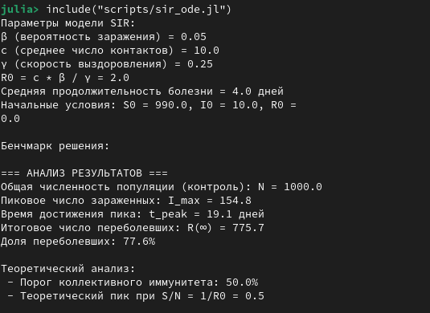
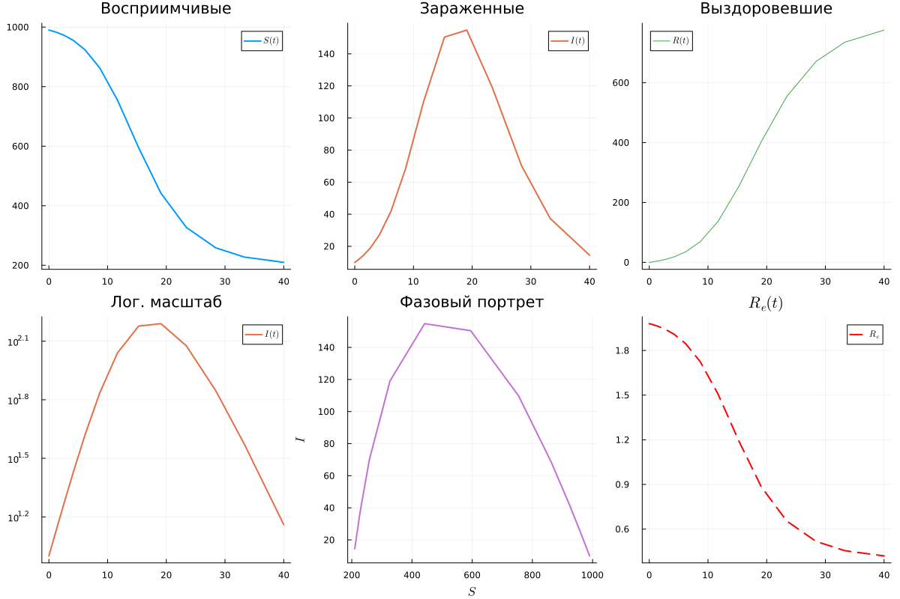
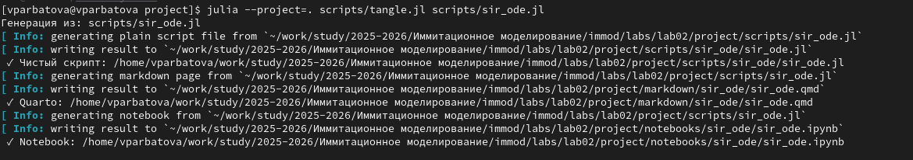
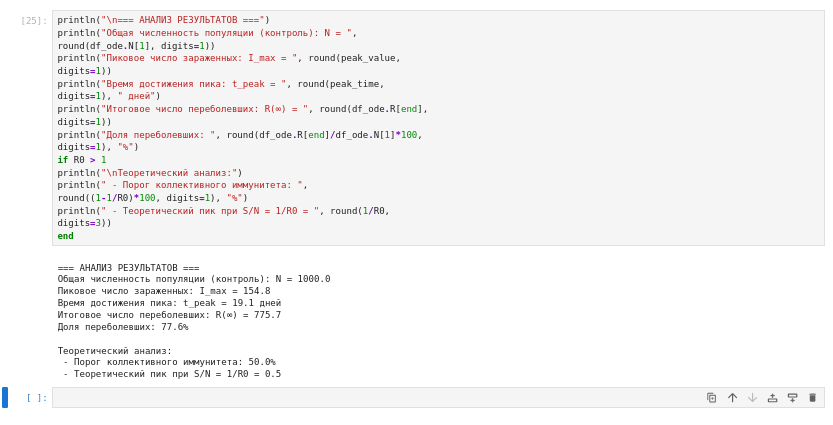
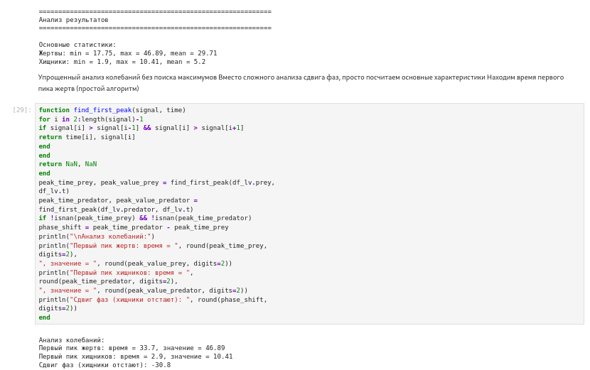
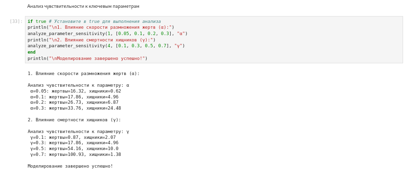

---
## Author
author:
  name: Арбатова Варвара Петровна
  degrees: DSc
  orcid: 0000-0002-0877-7063
  email: 1132236020@rudn.ru
  affiliation:
    - name: Российский университет дружбы народов
      country: Российская Федерация
      postal-code: 117198
      city: Москва
      address: ул. Миклухо-Маклая, д. 6
## Title
title: Презентация по лабораторной работе №2
subtitle: Иммитационное моделирование
license: CC BY
date: today
date-format: "YYYY-MM-DD" # Example: 2025-09-06
---

# Информация

## Докладчик

:::::::::::::: {.columns align=center}
::: {.column width="70%"}

  * Арбатова Варвара Петровна
  * студентка НКНбд-01-23
  * Российский университет дружбы народов им. П. Лумумбы
  * <https://vparbatova.github.io/ru/>
  * 1132236020@pfur.ru

:::
::::::::::::::

# Цель работы

Выполнить предложенный код и изучить, как работают модели SIR и Лотки-Вольтерры

# Задание

— Создать рабочий каталог для кода.
— Установить необходимые пакеты.
— Выполнить предложенный код.
— Преобразовать код в литературный стиль.
— Сгенерировать из литературного кода:
— чистый код;
— jupyter notebook;
— документацию в формате Quarto.
— Выполнить код из jupyter notebook.
— Интегрировать документацию в формате Quarto в отчёт.
— Добавить в код в литературном стиле вычисление для набора параметров.
— Сгенерировать из литературного кода с параметрами:
— чистый код;
— jupyter notebook;
— документацию в формате Quarto.
— Выполнить код из jupyter notebook с параметрами.
— Интегрировать документацию с параметрами в формате Quarto в отчёт

# Теоретическое введение

Модель SIR есть классическая и фундаментальная математическая модель эпиде-
миологии, описывающая распространение инфекционного заболевания в закры-
той популяции [2; 3]

Модель SIR делит всю популяцию на три взаимосвязанные группы (компартменты), что отражено в её названии:
— 𝑆 — Susceptible (Восприимчивые): люди, которые не болели, не имеют иммунитета и могут заразиться.
— 𝐼 — Infectious (Инфицированные/Заразные): люди, которые в данный момент больны и могут передавать инфекцию.
— 𝑅 — Recovered (Выздоровевшие/Удаленные): люди, которые переболели и приобрели иммунитет (или умерли). Они больше не участвуют в процессе передачи.
Основная цель модели: не предсказать судьбу конкретного человека, а понять общую динамику эпидемии — будет ли она разрастаться, как быстро, сколько
людей в итоге переболеет, как влияют карантинные меры.

Модель Лотки-Вольтерры — это фундаментальная математическая модель в экологии, описывающая динамику взаимодействия двух видов: хищников и жертв.
Она была независимо предложена в 1920-х годах:
— Альфредом Лоткой (1925) для химических реакций [5; 6].
— Витторио Вольтеррой (1926) для объяснения колебаний улова рыбы в Адриатическом море [8; 9].
Модель демонстрирует, как даже простая система взаимодействий может порождать сложные колебательные режимы, объясняя циклические изменения численности в природных экосистемах.

# Выполнение лабораторной работы

## Рабочее пространство

Создаю рабочее пространство по гайду из первой лабораторной работы ([рис. @fig-001]).

{#fig-001 width=70%}

## Библиотеки

Скачиваю недостающие библиотеки для лабораторной работы ([рис. @fig-002]).

{#fig-002 width=70%}

## Модель SIR

**SIR** — это классическая компартментная модель в эпидемиологии, описывающая распространение инфекционного заболевания в популяции. Название происходит от трёх состояний индивидов:

- **S (Susceptible)** — восприимчивые к болезни (здоровые, но могут заразиться)
- **I (Infectious)** — инфицированные (заразны и могут передавать болезнь)
- **R (Recovered)** — выздоровевшие (приобрели иммунитет и больше не участвуют в распространении)

## 

Модель описывается следующей системой ОДУ:

$$
\begin{cases}
\dfrac{dS}{dt} = -\beta \cdot S \cdot I \\[1.2em]
\dfrac{dI}{dt} = \beta \cdot S \cdot I - \gamma \cdot I \\[1.2em]
\dfrac{dR}{dt} = \gamma \cdot I
\end{cases}
$$

Параметры модели
- **$\beta$** — коэффициент передачи инфекции (скорость заражения)
- **$\gamma$** — коэффициент выздоровления (обратная величина средней продолжительности болезни)

## 

Базовое репродуктивное число
Важнейший эпидемиологический показатель:

$$
R_0 = \frac{\beta \cdot S_0}{\gamma}
$$

- $R_0 > 1$ — эпидемия разрастается  
- $R_0 < 1$ — эпидемия затухает  

## 

Основные свойства
- Полное население $N = S + I + R$ остаётся постоянным
- Модель не учитывает рождаемость, смертность (кроме выздоровления) и миграцию
- Подходит для острых инфекций с пожизненным иммунитетом (корь, грипп и др.)

## Работа кода

На прикрепленном скриншоте виден анализ результатов выполнения предложенного кода ([рис. @fig-003]).

{#fig-003 width=70%}

## Графики

В коде также прописано создание графиков для наглядности результатов. Все они на одном изображении приложенны ниже ([рис. @fig-004]).

{#fig-004 width=70%}

## Чистый код

С помощью файла, созданного в хоже выполнения лабораторной работы номер 1, создаю читсый код, markdown и jupyter notebook одной командой ([рис. @fig-005]).

{#fig-005 width=70%}

## Jupyter notebook 

Выполняю jupyter notebook, получаю все те же результаты ([рис. @fig-006]).

{#fig-006 width=70%}

## Модель Лотки-Вольтерры

**Модель Лотки-Вольтерры** — это классическая математическая модель, описывающая динамику взаимодействия двух биологических популяций: хищников и жертв. Модель была независимо предложена Альфредом Лоткой (1925) и Вито Вольтеррой (1926).

##

Модель описывается следующей системой ОДУ:

$$
\begin{cases}
\dfrac{dx}{dt} = \alpha x - \beta x y \\[1.2em]
\dfrac{dy}{dt} = \delta x y - \gamma y
\end{cases}
$$

где:
- $x$ — популяция жертв (например, зайцы)
- $y$ — популяция хищников (например, лисы)

##

Параметры модели
- **$\alpha$** — коэффициент естественного прироста жертв (в отсутствие хищников)
- **$\beta$** — коэффициент смертности жертв от встреч с хищниками (интенсивность хищничества)
- **$\delta$** — коэффициент прироста хищников за счет потребления жертв (эффективность конверсии биомассы)
- **$\gamma$** — коэффициент естественной смертности хищников (в отсутствие жертв)

##

Система имеет две стационарные точки:

1. **Тривиальное равновесие** (вымирание обоих видов):
   $$(x^*, y^*) = (0, 0)$$

2. **Нетривиальное равновесие** (сосуществование видов):
   $$x^* = \frac{\gamma}{\delta}, \quad y^* = \frac{\alpha}{\beta}$$

## Фазовый портрет и изоклины

**Изоклины** (линии нулевого роста):

- Для жертв ($dx/dt = 0$): $y = \alpha / \beta$ (вертикальная линия на фазовой плоскости)
- Для хищников ($dy/dt = 0$): $x = \gamma / \delta$ (горизонтальная линия)

## Характер динамики
- В окрестности нетривиальной стационарной точки система демонстрирует **циклические колебания**
- На фазовой плоскости траектории представляют собой **замкнутые кривые** (циклы)
- Амплитуда и период колебаний зависят от начальных условий и параметров
- Хищники следуют за изменениями популяции жертв с **фазовым сдвигом**

## Основные свойства
- Полная энергия системы (в консервативном приближении) сохраняется
- Система является **консервативной** (имеет первый интеграл):
  
  $$V = \delta x + \beta y - \gamma \ln x - \alpha \ln y = \text{const}$$

- Модель не учитывает внутривидовую конкуренцию, ограниченность ресурсов и другие факторы

##

Провожу все те же манипуляции для второй модели и выполняю созданный jupyter notebook ([рис. @fig-007]).

{#fig-007 width=70%}

##

Анализ чувствительности к параметрам ([рис. @fig-008]).

{#fig-008 width=70%}

##

Графики для наглядности результатов ([рис. @fig-009]).

{#fig-009 width=70%}

# Выводы

Я ознакомилась с двумя моделями и выполнила предложенный код

# Список литературы{.unnumbered}

::: {#refs}
:::
