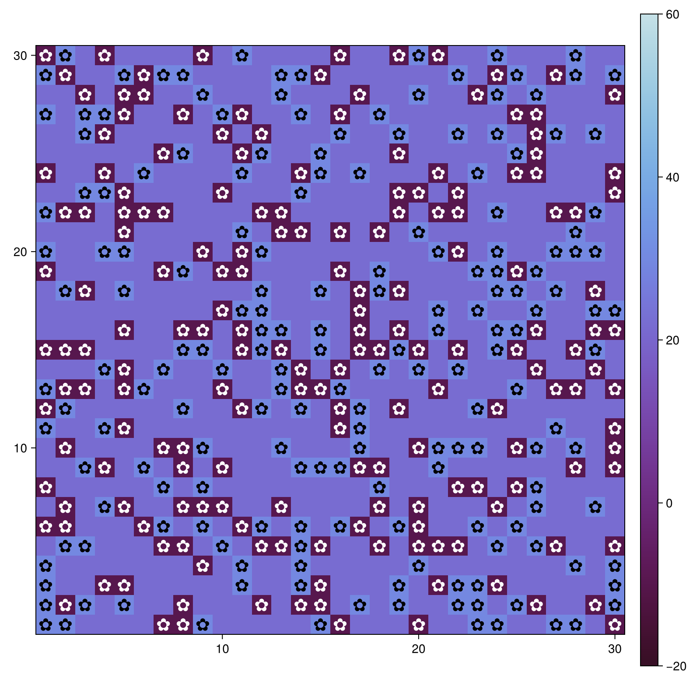
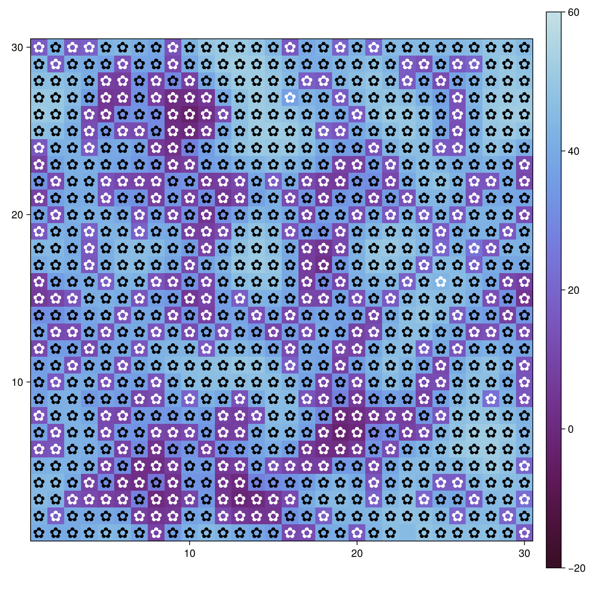
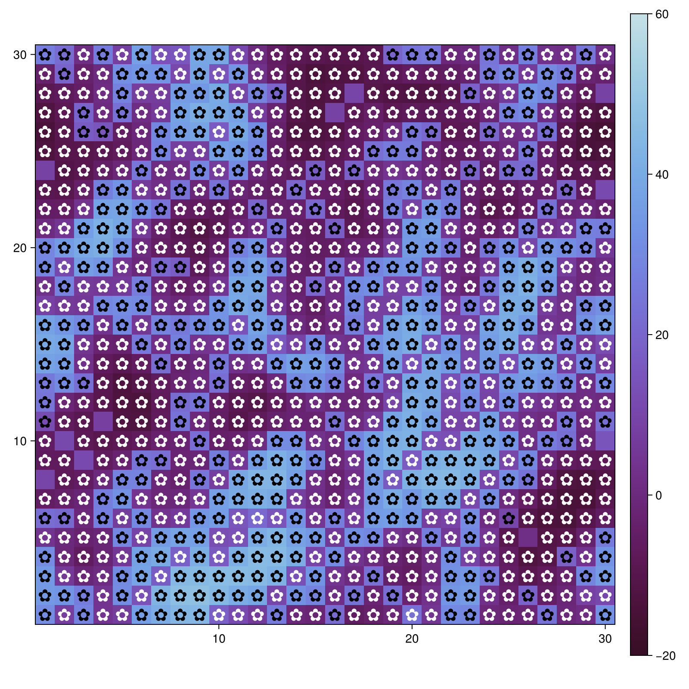

---
## Author
author:
  name: Арбатова Варвара Петровна
  degrees: DSc
  orcid: 0000-0002-0877-7063
  email: 1132236020@rudn.ru
  affiliation:
    - name: Российский университет дружбы народов
      country: Российская Федерация
      postal-code: 117198
      city: Москва
      address: ул. Миклухо-Маклая, д. 6
## Title
title: Презентация по лабораторной работе №3
subtitle: Иммитационное моделирование
license: CC BY
date: today
date-format: "YYYY-MM-DD" # Example: 2025-09-06
---

# Информация

## Докладчик

:::::::::::::: {.columns align=center}
::: {.column width="70%"}

  * Арбатова Варвара Петровна
  * студентка
  * Российский университет дружбы народов им. П. Лумумбы
  * [1132236020@rudn.ru]
  * <https://vparbatova.github.io/ru/>
  
:::
::::::::::::::

# Теоретическое введение

## Агентный подход

Агентный подход к имитационному моделированию (Agent-Based Modeling, ABM)
— это метод исследования сложных систем, в котором поведение системы возника-
ет из взаимодействия множества автономных сущностей, называемых агентами.
Вместо того чтобы описывать систему глобальными уравнениями, мы моделиру-
ем каждую индивидуальную единицу и правила её поведения, а затем наблюдаем,
какие коллективные паттерны появляются снизу вверх. Этот подход особенно
полезен, когда поведение системы трудно предсказать из-за нелинейностей, ге-
терогенности участников или адаптивных стратегий.

## Условия задачи

В модели Daisyworld агентами являются чёрные и белые маргаритки. Они живут
на клеточной сетке (среда).
Свойства агентов: вид и возраст.
Правила:

— Маргаритки изменяют локальную температуру за счёт разного альбедо.

— Температура влияет на вероятность размножения (чем ближе к оптимуму, тем
выше шанс заселить соседнюю пустую клетку).

— Агенты стареют и умирают после определённого возраста.

— Среда (температура) диффундирует между клетками.

# Выполнение лабораторной работы

## Выполнение лабораторной работы

Создаю файл, в котором будет храниться информация об агентах([рис. @fig-001])

{#fig-001 width=70%}

## Выполнение лабораторной работы

Запускаю этот файл ([рис. @fig-002])

{#fig-002 width=70%}

## Выполнение лабораторной работы

Создаю файл, в котором будет проходить симулция и рисоваться графики ([рис. @fig-003])

{#fig-003 width=70%}

## Выполнение лабораторной работы

Запускаю файл([рис. @fig-004])

{#fig-004 width=70%}

## Выполнение лабораторной работы

В результате работы файла были созданы 3 графика, которые отображают расположение чёрных и белых незабудок и температуру вокруг них. Начальное состояние изображено на первом графике ([рис. @fig-005])

{#fig-005 width=70%}

## Выполнение лабораторной работы

Состояние поля через 5 единиц времени ([рис. @fig-006])

{#fig-006 width=70%}

## Выполнение лабораторной работы

Состояние через 40 единиц времени. Как можно заметить, вокруг незабудок каждого цвета сформировалась своя температура, которая нигде не достигает ни максимума, ни минимума, а незабудки заполнили все клеточки, свободных не осталось ([рис. @fig-007])

{#fig-007 width=70%}

# Выводы

Я получила опыт работы с агентным подходом
