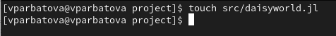
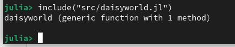
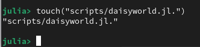
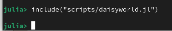

---
## Author
author:
  name: Арбатова Варвара Петровна
  degrees: DSc
  orcid: 0000-0002-0877-7063
  email: 1132236020@rudn.ru
  affiliation:
    - name: Российский университет дружбы народов
      country: Российская Федерация
      postal-code: 117198
      city: Москва
      address: ул. Миклухо-Маклая, д. 6

## Title
title: "Отчёт по лабораторной работе №3"
subtitle: "Иммитационное моделирование"
license: "CC BY"
---

# Цель работы

Познакомиться с агентным подходом к иммитационному моделированию

# Задание

— Создайте файл scripts/daisyworld.jl.
— Запустите его.
— Проанализируйте результат.
— Преобразуйте код в литературный стиль.
— Сгенерируйте из литературного кода:
— чистый код;
— jupyter notebook;
— документацию в формате Quarto.
— Выполните код из jupyter notebook.
— Интегрируйте документацию в формате Quarto в отчёт.

# Теоретическое введение

Агентный подход к имитационному моделированию (Agent-Based Modeling, ABM)
— это метод исследования сложных систем, в котором поведение системы возника-
ет из взаимодействия множества автономных сущностей, называемых агентами.
Вместо того чтобы описывать систему глобальными уравнениями, мы моделиру-
ем каждую индивидуальную единицу и правила её поведения, а затем наблюдаем,
какие коллективные паттерны появляются снизу вверх. Этот подход особенно
полезен, когда поведение системы трудно предсказать из-за нелинейностей, ге-
терогенности участников или адаптивных стратегий.

Модель Daisyworld, предложенная Джеймсом Лавлоком и Эндрю Уотсоном, иллю-
стрирует гипотезу Геи [2; 11]. Гипотеза Геи рассматривает планету как единую,
саморегулирующуюся систему, включающую как живые, так и неживые части.
В мире маргариток произрастают чёрные и белые маргаритки. Их альбедо раз-
личается: чёрные маргаритки поглощают свет и тепло, нагревая окружающую
среду; белые маргаритки делают наоборот. Маргаритки могут размножаться толь-
ко в определённом температурном диапазоне, а это значит, что слишком много
(или слишком мало) тепла от солнца и/или окружающей среды в конечном итоге
остановит их размножение.
Поверхность Геи нагревается солнцем, но растущие на ней маргаритки поглощают
или отражают свет звёзд, изменяя локальную температуру.
Если температура становится слишком высокой или слишком низкой, маргаритки
не захотят размножаться. Пока температура благоприятна, маргаритки конкури-
руют за землю и пытаются дать начало новому растению в местах, расположенных
неподалёку от них.
Когда климат слишком холодный, черным маргариткам необходимо размножать-
ся, чтобы повысить температуру, и наоборот — когда климат слишком теплый,
необходимо производить больше белых маргариток, чтобы охладить климат.
Взаимодействие живых и неживых аспектов этого мира находит равновесие в
широком диапазоне параметров, хотя при достаточно сильном внешнем воздей-
ствии маргаритки не смогут регулировать температуру планеты и в конечном
итоге вымрут.

В модели Daisyworld агентами являются чёрные и белые маргаритки. Они живут
на клеточной сетке (среда).
Свойства агентов: вид и возраст.
Правила:

— Маргаритки изменяют локальную температуру за счёт разного альбедо.

— Температура влияет на вероятность размножения (чем ближе к оптимуму, тем
выше шанс заселить соседнюю пустую клетку).

— Агенты стареют и умирают после определённого возраста.

— Среда (температура) диффундирует между клетками.

# Выполнение лабораторной работы

Создаю файл, в котором будет храниться информация об агентах([рис. @fig-001])

{#fig-001 width=70%}

Запускаю этот файл ([рис. @fig-002])

{#fig-002 width=70%}

Создаю файл, в котором будет проходить симулция и рисоваться графики ([рис. @fig-003])

{#fig-003 width=70%}

Запускаю файл([рис. @fig-004])

{#fig-004 width=70%}

Так делаю со всеми файлами из лабораторной

В результате работы файла были созданы 3 графика, которые отображают расположение чёрных и белых незабудок и температуру вокруг них. Начальное состояние изображено на первом графике ([рис. @fig-005])

{#fig-005 width=70%}

Состояние поля через 5 единиц времени ([рис. @fig-006])

{#fig-006 width=70%}

Состояние через 40 единиц времени. Как можно заметить, вокруг незабудок каждого цвета сформировалась своя температура, которая нигде не достигает ни максимума, ни минимума, а незабудки заполнили все клеточки, свободных не осталось ([рис. @fig-007])

{#fig-007 width=70%}

Анализ результатов и код из файлов предоставлен ниже.

## Код и анализ daisyworld.gl



## Код и анализ daisyworld-count.jl



## Код и анализ daisyworld-luminosity.jl



## Код и анализ daisyworld__param.jl



## Код и анализ daisyworld-count__param.jl



## Код и анализ daisyworld-luminosity__param.jl



# Вывод

В ходе выполнения лабораторной работы была успешно реализована и исследована агентная модель Daisyworld. 

# Список литературы{.unnumbered}

[Лабораторная работ №3. Агентное моделирование](https://esystem.rudn.ru/pluginfile.php/3094247/mod_resource/content/2/simulation-modeling-lab.pdf#chapter.3)

# Выводы

Я получила опыт работы с агентным подходом

# Список литературы{.unnumbered}

::: {#refs}

[Лабораторная работа № 3 ](https://esystem.rudn.ru/pluginfile.php/3094247/mod_resource/content/2/simulation-modeling-lab.pdf)
:::
