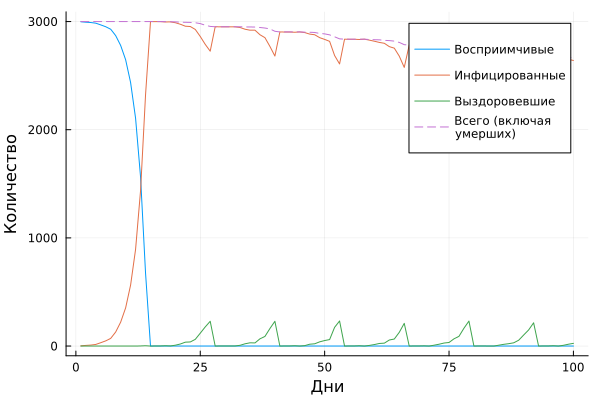
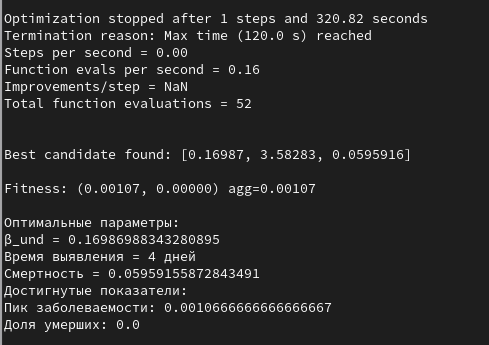

---
## Author
author:
  name:  Арбатова Варвара Петровна
  email: 1132236020@rudn.ru
  affiliation:
    - name: Российский университет дружбы народов
      country: Российская Федерация
      city: Москва
      address: ул. Миклухо-Маклая, д. 6
## Title
title: Презентация по лабораторной работе №4
subtitle: Иммитационное моделирование
license: CC BY
date: today
date-format: "YYYY-MM-DD" # Example: 2025-09-06
---

#  Информация

## Докладчик

:::::::::::::: {.columns align=center}
::: {.column width="70%"}

  * Арбатова Варвара Петровна
  * студентка
  * Российский университет дружбы народов им. П. Лумумбы
  * [1132236020@rudn.ru]
  * <https://vparbatova.github.io/ru/>
  
:::
::::::::::::::

# Цель работы

Совместить знания, полученные в двух предыдущих работах

# Выполнение лабораторной работы

## Базовый эксперимент

Четыре линии: S(t), I(t), R(t) и общая
численность (пунктир). Позволяет визуально оценить пик эпидемии,
скорость распространения и влияние смертности

{#fig-001 width=70%}

## Сканирование коэффициента заразности

Исследует, как изменение базовой заразности (beta_und и пропорционально beta_det)
влияет на эпидемические показатели: пик заболеваемости, долю переболевших,
число умерших. Выполняется параметрическое сканирование с несколькими
повторными прогонами для учёта стохастичности.
График показывает зависимость от beta:
— средняя пиковая доля инфицированных;
— средняя конечная доля инфицированных;
— средняя доля умерших (нормированная на численность).
График позволяет найти пороговое значение beta, при котором возникает эпидемия,
и оценить, как увеличивается нагрузка на систему с ростом заразности

## График

{#fig-002 width=70%}

## Исследование эффекта миграции

Исследует, как интенсивность перемещения людей между городами влияет на
скорость распространения эпидемии (время достижения пика) и масштаб пика.
Инфекция начинается только в одном городе, остальные изначально здоровы.
График: Два подграфика (или один с
двумя осями Y), показывающие:
— время достижения пика (в днях) vs интенсивность миграции;
— пиковую численность инфицированных vs интенсивность миграции.
График демонстрирует, как ускорение обмена людьми между городами приводит
к более раннему и более высокому пику эпидемии

## График

{#fig-003 width=70%}

## Многокритериальная оптимизация параметров

Ищет оптимальные комбинации параметров, минимизирующие одновременно
два критерия: пиковую заболеваемость и долю умерших. Использует эволюцион-
ный алгоритм (Borg MOEA) из пакета BlackBoxOptim.
Этот скрипт позволяет найти компромиссные стратегии управления (например,
раннее выявление снижает пик, но не влияет на смертность).

## График

{#fig-004 width=70%}

## Сводная визуализация результатов

Этот скрипт загружает результаты параметрического сканирования (файл
data/beta_scan_all.csv, созданный scan_beta.jl) и строит единый составной
график, объединяющий три панели:
— пик эпидемии и конечная доля инфицированных;
— число умерших;
— доля выздоровевших.
Скрипт предназна-
чен для итогового отчёта и не требует повторного запуска симуляций
График: Три панели, позволяющие одновременно оценить:
— порог возникновения эпидемии (рост пика);
— нелинейное увеличение смертности;
— насыщение доли переболевших.
— В консоль может выводиться дополнительная статистика 
В отличие от scan_beta.jl, этот скрипт не выполняет симуляции, а только визуа-
лизирует уже полученные данные. Это позволяет быстро перестраивать графики
при изменении оформления, не тратя время на повторные расчёты. 

## График

{#fig-005 width=70%}

# Выводы

Реализация модели SIR с помощью агентного подхода открывает возможности для более глубокого и гибкого анализа эпидемиологических процессов. Мы можем исследовать влияние индивидуальных характеристик, пространственной структуры и стохастичности на динамику эпидемии. Это делает ABM незаменимым инструментом для изучения сложных систем, где простота классических моделей уступает место реалистичности и детализации.

В ходе выполнения лабораторной работы вы создадите такую модель, проведете серию вычислительных экспериментов, проанализируете их результаты и научитесь оформлять их в виде воспроизводимых отчетов с использованием литературного программирования.

# Список литературы{.unnumbered}

[Лабораторная работ №4](https://esystem.rudn.ru/pluginfile.php/3094247/mod_resource/content/3/simulation-modeling-lab.pdf)

::: {#refs}
:::
