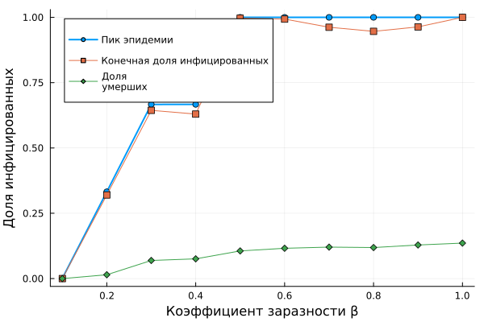
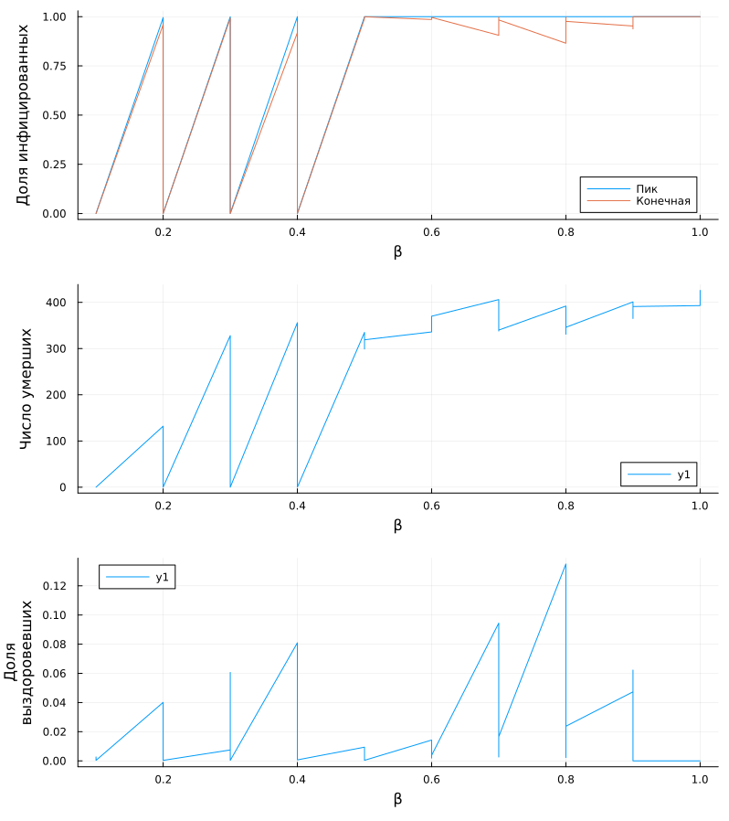

---
## Author
author:
  name: Арбатова Варвара Петровна
  degrees: DSc
  orcid: 0000-0002-0877-7063
  email: 1132236020@rudn.ru
  affiliation:
    - name: Российский университет дружбы народов
      country: Российская Федерация
      postal-code: 117198
      city: Москва
      address: ул. Миклухо-Маклая, д. 6

## Title
title: "Отчёт по лабораторной работе №4"
subtitle: "Иммитационное моделирование"
license: "CC BY"
execute:
  eval: false
---

# Цель работы

Здесь приводится формулировка цели лабораторной работы.
Формулировки цели для каждой лабораторной работы приведены в методических указаниях.

Цель данного шаблона --- максимально упростить подготовку отчётов по лабораторным работам.
Модифицируя данный шаблон, студенты смогут без труда подготовить отчёт по лабораторным работам, а также познакомиться с основными возможностями разметки Markdown.

# Задание

— Создать рабочий каталог для кода.
— Установить необходимые пакеты.
— Выполнить предложенный код.
— Преобразовать код в литературный стиль.
— Сгенерировать из литературного кода:
— чистый код;
— jupyter notebook;
— документацию в формате Quarto.
— Выполнить код из jupyter notebook.
— Интегрировать документацию в формате Quarto в отчёт.
— Добавить в код в литературном стиле вычисление для набора параметров.
— Сгенерировать из литературного кода с параметрами:
— чистый код;
— jupyter notebook;
— документацию в формате Quarto.
— Выполнить код из jupyter notebook с параметрами.
— Интегрировать документацию с параметрами в формате Quarto в отчёт.

# Теоретическое введение

## 1. Агентное моделирование: от глобальных уравнений к локальным взаимодействиям

Агентное моделирование (Agent-Based Modeling, ABM) представляет собой мощный метод исследования сложных систем, который кардинально отличается от классического подхода, основанного на дифференциальных уравнениях. Вместо того чтобы описывать систему с помощью глобальных переменных и уравнений, ABM моделирует поведение множества автономных сущностей — **агентов** — и правила их взаимодействия. Наблюдая за тем, как локальные действия агентов порождают коллективные паттерны, мы можем понять эмерджентное поведение системы, возникающее «снизу вверх».

Этот подход особенно ценен, когда система обладает следующими свойствами:
*   **Гетерогенность:** участники системы не идентичны, а обладают индивидуальными характеристиками (возраст, иммунитет, социальная активность).
*   **Нелокальность и сложные взаимодействия:** взаимодействия происходят не «со всеми», а с ближайшим окружением.
*   **Адаптивность:** участники могут менять свое поведение в ответ на изменения среды.
*   **Стохастичность:** процессы в системе имеют случайную природу, что критически важно для малых популяций.

## 2. Основные компоненты агентной модели

Любая агентная модель, включая ту, что будет разработана в данной работе, строится из трех ключевых компонентов:

### 2.1. Агенты
Агенты — это активные, автономные сущности, населяющие модель. Каждый агент обладает:
*   **Свойствами (атрибутами):** набором характеристик, определяющих его состояние. Например, в эпидемиологической модели это может быть статус здоровья (восприимчив, инфицирован, выздоровел) и количество дней с момента заражения.
*   **Правилами поведения:** набором действий, которые агент может выполнять на каждом шаге моделирования. Например, взаимодействовать с другими агентами, перемещаться в пространстве, менять свой статус.

### 2.2. Среда
Это пространство, в котором существуют и взаимодействуют агенты. Среда может быть:
*   **Дискретной:** например, клеточная сетка или граф, где узлы представляют собой отдельные локации (города, районы).
*   **Непрерывной:** двумерное или трехмерное пространство с координатами.
В нашей работе мы будем использовать **пространство в виде графа**, где вершины символизируют города, а ребра — возможные пути миграции между ними.

### 2.3. Взаимодействия
Взаимодействия — это правила, которые определяют, как агенты влияют друг на друга и на среду. Они могут быть:
*   **Локальными:** агент взаимодействует только с теми, кто находится в той же локации.
*   **Глобальными:** все агенты взаимодействуют со всеми.
*   **Через среду:** например, инфицированные агенты повышают вероятность заражения для восприимчивых агентов в своей локации.

## 3. Преимущества агентного подхода перед классическими моделями

В рамках четвертой лабораторной работы мы реализуем эпидемиологическую модель SIR. Классическая модель SIR, описываемая системой обыкновенных дифференциальных уравнений, имеет ряд ограничений, которые успешно преодолеваются с помощью ABM.

| Характеристика | Классическая модель SIR (ОДУ) | Агентная модель SIR (ABM) |
| :--- | :--- | :--- |
| **Популяция** | Однородная, все индивиды идентичны. | Гетерогенная, каждый индивид уникален. |
| **Взаимодействие** | Полное перемешивание (массовое действие). | Локальное взаимодействие в пространстве или социальной сети. |
| **Детерминизм** | Детерминированная динамика (один и тот же результат при одинаковых начальных условиях). | Стохастическая динамика, учитывающая случайные флуктуации (особенно важна на начальном этапе). |
| **Численность** | Рассматривается как непрерывная величина. | Рассматривается как дискретное целое число людей. |
| **Пространство** | Отсутствует. | Присутствует, позволяет моделировать миграцию и пространственную изоляцию. |

## 4. Модель SIR в агентном подходе

В данной работе мы перенесем классическую компартментальную модель SIR в парадигму агентного моделирования. Это позволит нам учесть пространственную структуру (несколько городов) и стохастичность процесса, а также изучить такие эффекты, как влияние миграции на скорость распространения эпидемии.

### 4.1. Агенты (население)
Каждый агент представляет собой человека и характеризуется двумя ключевыми свойствами:
*   `status`: текущее состояние агента, которое может быть одним из трех:
    *   `:S` (Susceptible) — восприимчивый к инфекции.
    *   `:I` (Infectious) — инфицированный и способный заражать других.
    *   `:R` (Recovered) — выздоровевший и получивший иммунитет.
*   `days_infected`: целое число, указывающее, сколько дней агент уже болеет. Это свойство используется для определения момента выздоровления или смерти.

### 4.2. Среда (пространство)
В качестве среды используется граф, где каждый узел представляет собой отдельную локацию (город). Такое представление позволяет:
*   Учитывать пространственную структуру популяции.
*   Моделировать миграцию агентов между локациями с заданной вероятностью.
*   Изучать, как распространение инфекции зависит от связности и интенсивности перемещений.

### 4.3. Динамика модели
Процесс моделирования пошаговый, где каждый шаг соответствует одному дню. На каждом шаге для каждого агента выполняются следующие действия:

1.  **Миграция:** с определенной вероятностью агент может переместиться в другую локацию (город). Вероятность миграции задается матрицей переходов.
2.  **Передача инфекции:** если агент инфицирован, он может заразить восприимчивых агентов в своей текущей локации. Количество новых заражений определяется с помощью пуассоновского процесса, интенсивность которого зависит от того, выявлен ли агент (заразность `β_und`) или нет (`β_det`).
3.  **Обновление счетчика болезни:** для инфицированных агентов увеличивается счетчик дней болезни (`days_infected`).
4.  **Выздоровление или смерть:** если агент болеет дольше заданного периода (`infection_period`), он либо выздоравливает (переходит в состояние `:R`) с вероятностью `1 - death_rate`, либо умирает (удаляется из модели) с вероятностью `death_rate`.

# Выполнение лабораторной работы

## Базовый эксперимент

Запускает один эксперимент с фиксированными параметрами (по умолчанию) и
сохраняет динамику численности агентов. Это служит для проверки работоспо-
собности модели и получения базового понимания эпидемического процесса
График: plots/sir_basic_dynamics.png — четыре линии: S(t), I(t), R(t) и общая
численность (пунктир) ([рис. @fig-001]) . Позволяет визуально оценить пик эпидемии,
скорость распространения и влияние смертности



График:

{#fig-001 width=70%}

## Сканирование коэффициента заразности

Исследует, как изменение базовой заразности (beta_und и пропорционально beta_det)
влияет на эпидемические показатели: пик заболеваемости, долю переболевших,
число умерших. Выполняется параметрическое сканирование с несколькими
повторными прогонами для учёта стохастичности.
График: plots/beta_scan.png ([рис. @fig-002]) показывает зависимость от beta:
— средняя пиковая доля инфицированных;
— средняя конечная доля инфицированных;
— средняя доля умерших (нормированная на численность).
График позволяет найти пороговое значение beta, при котором возникает эпидемия,
и оценить, как увеличивается нагрузка на систему с ростом заразности



График:

{#fig-002 width=70%}

## Исследование эффекта миграции

Исследует, как интенсивность перемещения людей между городами влияет на
скорость распространения эпидемии (время достижения пика) и масштаб пика.
Инфекция начинается только в одном городе, остальные изначально здоровы.
График: plots/migration_effect.png ([рис. @fig-003]) . Два подграфика (или один с
двумя осями Y), показывающие:
— время достижения пика (в днях) vs интенсивность миграции;
— пиковую численность инфицированных vs интенсивность миграции.
График демонстрирует, как ускорение обмена людьми между городами приводит
к более раннему и более высокому пику эпидемии



График:

{#fig-003 width=70%}

## Многокритериальная оптимизация параметров

Ищет оптимальные комбинации параметров, минимизирующие одновременно
два критерия: пиковую заболеваемость и долю умерших. Использует эволюцион-
ный алгоритм (Borg MOEA) из пакета BlackBoxOptim.
Этот скрипт позволяет найти компромиссные стратегии управления (например,
раннее выявление снижает пик, но не влияет на смертность). ([рис. @fig-004])



{#fig-004 width=70%}

## Сводная визуализация результатов

Этот скрипт загружает результаты параметрического сканирования (файл
data/beta_scan_all.csv, созданный scan_beta.jl) и строит единый составной
график, объединяющий три панели:
— пик эпидемии и конечная доля инфицированных;
— число умерших;
— доля выздоровевших.
Скрипт предназна-
чен для итогового отчёта и не требует повторного запуска симуляций
График: plots/comprehensive_analysis.png . Три панели, позволя-
ющие одновременно оценить:
— порог возникновения эпидемии (рост пика);
— нелинейное увеличение смертности;
— насыщение доли переболевших.
— В консоль может выводиться дополнительная статистика (например, значения
β, при которых пик превышает 5%).
В отличие от scan_beta.jl, этот скрипт не выполняет симуляции, а только визуа-
лизирует уже полученные данные. Это позволяет быстро перестраивать графики
при изменении оформления, не тратя время на повторные расчёты. ([рис. @fig-005])



График:

{#fig-005 width=70%}

# Выводы

Реализация модели SIR с помощью агентного подхода открывает возможности для более глубокого и гибкого анализа эпидемиологических процессов. Мы можем исследовать влияние индивидуальных характеристик, пространственной структуры и стохастичности на динамику эпидемии. Это делает ABM незаменимым инструментом для изучения сложных систем, где простота классических моделей уступает место реалистичности и детализации.

В ходе выполнения лабораторной работы вы создадите такую модель, проведете серию вычислительных экспериментов, проанализируете их результаты и научитесь оформлять их в виде воспроизводимых отчетов с использованием литературного программирования.

# Список литературы{.unnumbered}

[Лабораторная работ №4](https://esystem.rudn.ru/pluginfile.php/3094247/mod_resource/content/3/simulation-modeling-lab.pdf)

::: {#refs}
:::
