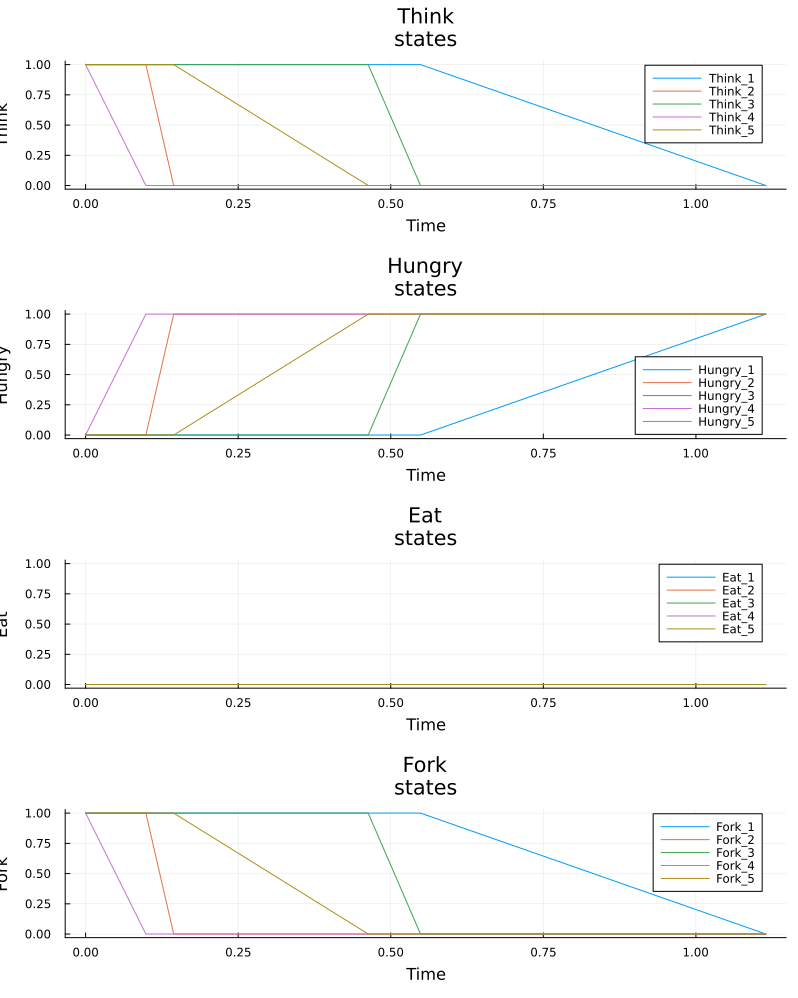
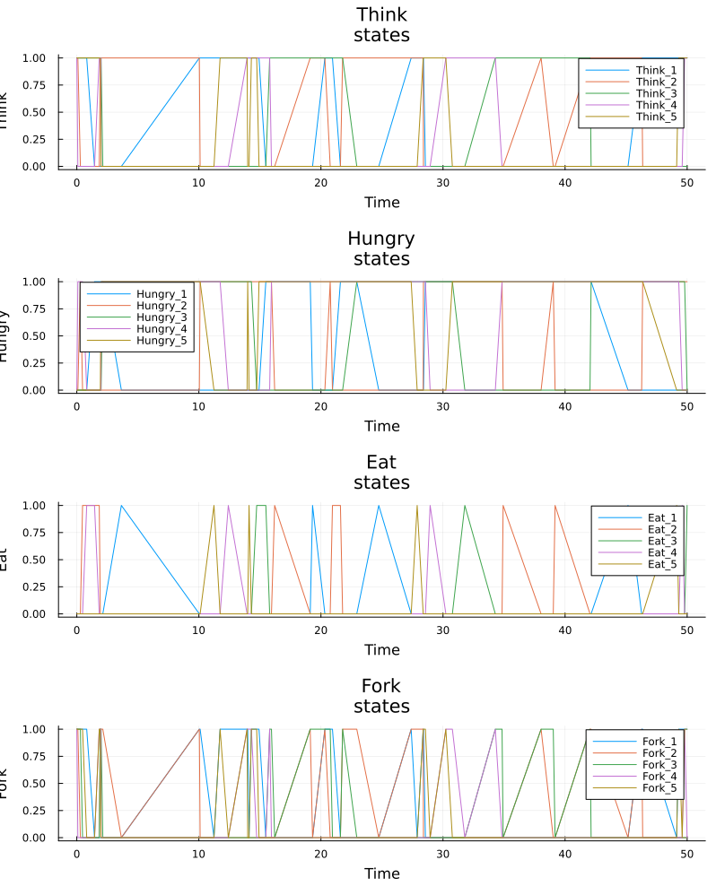
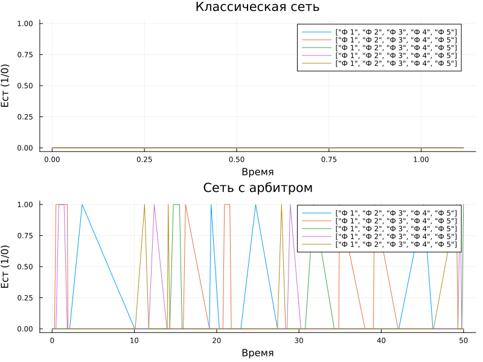
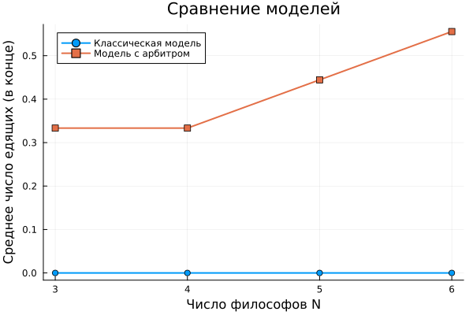

---
## Author
author:
  name: Арбатова Варвара Петровна
  email: 1132236020@rudn.ru
  affiliation:
    - name: Российский университет дружбы народов
      country: Российская Федерация
      postal-code: 117198
      city: Москва
      address: ул. Миклухо-Маклая, д. 6
## Title
title: Презентация по лабораторной работе №5
subtitle: Иммитационное моделирование
license: CC BY
date: today
date-format: "YYYY-MM-DD" # Example: 2025-09-06
---

#  Информация

## Докладчик

:::::::::::::: {.columns align=center}
::: {.column width="70%"}

  * Арбатова Варвара Петровна
  * студентка
  * Российский университет дружбы народов им. П. Лумумбы
  * [1132236020@rudn.ru]
  * <https://vparbatova.github.io/ru/>
  
:::
::::::::::::::

# Вводная часть

## Основные элементы сети Петри

Сеть Петри формально определяется как четвёрка:

$$N = (P, T, F, M_0)$$

где:
- $P = \{p_1, p_2, \dots, p_n\}$ — конечное множество позиций (круги);
- $T = \{t_1, t_2, \dots, t_m\}$ — конечное множество переходов (прямоугольники);
- $F \subseteq (P \times T) \cup (T \times P)$ — множество дуг;
- $M_0: P \to \mathbb{N}$ — начальная маркировка (распределение фишек по позициям).

## Свойства сетей Петри

- **Ограниченность (Boundedness)** — количество фишек в любой позиции сети никогда не превысит заданного предела $K$. Если $K = 1$, сеть называется безопасной.

- **Активность (Liveness)** — для любого перехода всегда существует достижимая маркировка, в которой он может сработать. Это гарантирует отсутствие вечных блокировок.

- **Достижимость (Reachability)** — возможность из начальной маркировки $M_0$ попасть в некоторую желаемую маркировку $M_k$.

- **Сохраняемость (Conservation)** — взвешенная сумма фишек по всем позициям остаётся постоянной (аналог закона сохранения массы или энергии).

## Задача «Обедающие философы»

За круглым столом сидят $N$ философов (обычно 5). Перед каждым философом стоит тарелка с едой. Между каждыми двумя соседними философами лежит одна вилка. Таким образом, количество вилок равно количеству философов.

## Правила поведения философов:

- Философ может находиться в одном из трёх состояний: думает, голоден (хочет есть), ест.
- Чтобы поесть, философу необходимы две вилки — та, что слева от него, и та, что справа.
- Если философ не может получить обе вилки одновременно, он ждёт, пока они освободятся.
- Поев, философ кладёт обе вилки обратно на стол и возвращается к размышлениям.

## Ограничения:
- Вилками нельзя пользоваться одновременно двум философам.
- Философ не может отнять вилку у соседа — только дождаться, пока тот её положит.

## Проблема взаимной блокировки (deadlock)

При наивной реализации (каждый философ сначала берёт левую вилку, затем правую) возникает тупиковая ситуация: если все философы одновременно возьмут левую вилку, то каждый будет ждать правую, которая уже занята соседом. В результате никто не может поесть — система замирает. Это и есть взаимная блокировка (deadlock).

# Выполнение лабораторной работы

## Базовые эксперименты

{#fig-001 width=70%}

## Базовые эксперименты

{#fig-002 width=70%}

## Итоговый отчёт

{#fig-003 width=70%}

## Вычисление для набора параметров

{#fig-004 width=70%}

## Вычисление для набора параметров

{#fig-005 width=70%}

## Вычисление для набора параметров

{#fig-006 width=70%}

