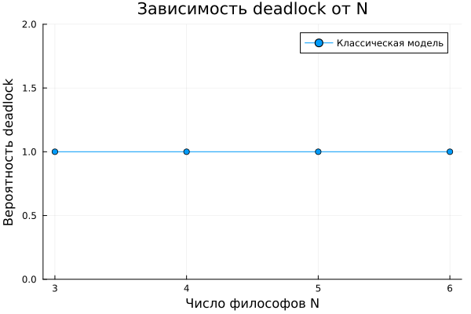
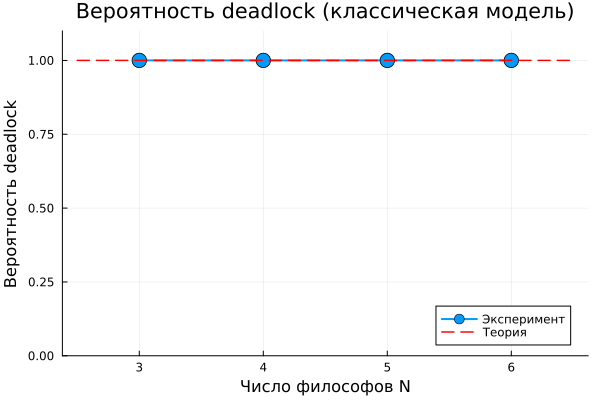
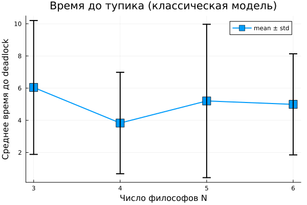

---
## Author
author:
  name: Арбатова Варвара Петровна
  degrees: DSc
  orcid: 0000-0002-0877-7063
  email: 1132236020@rudn.ru
  affiliation:
    - name: Российский университет дружбы народов
      country: Российская Федерация
      postal-code: 117198
      city: Москва
      address: ул. Миклухо-Маклая, д. 6

## Title
title: "Лабораторная работа №5"
subtitle: "Аппарат сетей Петри. Задача обедающих философов"
license: "CC BY"

bibliography: cite.bib
cite-method: biblatex
---

# Теоретическое введение

В основе данной лабораторной работы лежит аппарат сетей Петри [@lab5_petri_nets; @murata_petri_nets]. Для демонстрации проблем параллелизма была выбрана классическая задача «Обедающие философы» [@dijkstra_dining_philosophers]. Стохастическое моделирование выполнялось с использованием алгоритма Гиллеспи [@gillespie_stochastic], а для организации вычислительного эксперимента применялся пакет DrWatson [@datseris_drwatson].

## 1. Сети Петри: математический аппарат для моделирования дискретных систем

Сети Петри (Petri nets) — это математический аппарат для моделирования дискретных, параллельных и асинхронных систем, предложенный Карлом Адамом Петри в 1962 году. Графически сеть Петри представляется как двудольный ориентированный граф двух типов вершин: **позиции** (places) и **переходы** (transitions) [@lab05_manual].

### 1.1. Основные элементы сети Петри

Сеть Петри формально определяется как четвёрка:

$$N = (P, T, F, M_0)$$

где:
- $P = \{p_1, p_2, \dots, p_n\}$ — конечное множество позиций (круги);
- $T = \{t_1, t_2, \dots, t_m\}$ — конечное множество переходов (прямоугольники);
- $F \subseteq (P \times T) \cup (T \times P)$ — множество дуг;
- $M_0: P \to \mathbb{N}$ — начальная маркировка (распределение фишек по позициям).

**Позиции** (places) — пассивные элементы, описывающие состояние системы (наличие ресурса, выполнение условия). Внутри позиции находятся **фишки** (tokens) — неотрицательное целое число, указывающее на количество ресурсов.

**Переходы** (transitions) — активные элементы, описывающие события или действия системы. Они могут срабатывать, изменяя маркировку сети.

**Дуги** (arcs) — направленные соединения между позициями и переходами (но не между двумя позициями или двумя переходами). Входные дуги указывают, сколько фишек необходимо для срабатывания перехода; выходные дуги — сколько фишек появится после срабатывания.

### 1.2. Правило срабатывания перехода

Переход считается **разрешённым** (enabled), если каждая из его входных позиций содержит не менее фишек, чем указано кратностью входной дуги. Разрешённый переход может **сработать** (fire). Этот процесс:

1. Удаляет из каждой входной позиции количество фишек, равное кратности входной дуги;
2. Добавляет в каждую выходную позицию количество фишек, равное кратности выходной дуги.

Срабатывание перехода есть атомарная операция, которая происходит мгновенно и меняет маркировку сети. Если разрешено несколько переходов, любой из них может сработать (недетерминизм).

### 1.3. Свойства сетей Петри

Сети Петри используются не только для моделирования, но и для проверки корректности системы. Исследуются следующие важнейшие свойства:

- **Ограниченность (Boundedness)** — количество фишек в любой позиции сети никогда не превысит заданного предела $K$. Если $K = 1$, сеть называется безопасной.

- **Активность (Liveness)** — для любого перехода всегда существует достижимая маркировка, в которой он может сработать. Это гарантирует отсутствие вечных блокировок.

- **Достижимость (Reachability)** — возможность из начальной маркировки $M_0$ попасть в некоторую желаемую маркировку $M_k$.

- **Сохраняемость (Conservation)** — взвешенная сумма фишек по всем позициям остаётся постоянной (аналог закона сохранения массы или энергии).

### 1.4. Расширения сетей Петри

Для решения прикладных задач были разработаны расширения базового аппарата:

- **Временные сети Петри (Timed Petri Nets)** — каждому переходу приписывается время задержки, что позволяет моделировать системы реального времени.

- **Стохастические сети Петри (Stochastic Petri Nets)** — времена задержек задаются распределениями случайных величин. Это мощный инструмент для анализа производительности систем.

- **Раскрашенные сети Петри (Colored Petri Nets, CPN)** — фишкам приписываются «цвета» (типы данных), а переходы могут иметь выражения, что позволяет моделировать большие системы в компактной форме.

## 2. Задача «Обедающие философы» (Dining Philosophers)

Задача «Обедающие философы» была сформулирована Эдгером Дейкстрой в 1965 году как иллюстрация проблемы синхронизации в параллельных вычислительных системах. Она наглядно демонстрирует явления взаимной блокировки (deadlock) и голодания (starvation) при конкурентном доступе к разделяемым ресурсам.

### 2.1. Классическая постановка задачи

За круглым столом сидят $N$ философов (обычно 5). Перед каждым философом стоит тарелка с едой. Между каждыми двумя соседними философами лежит одна вилка. Таким образом, количество вилок равно количеству философов.

**Правила поведения философов:**

- Философ может находиться в одном из трёх состояний: думает, голоден (хочет есть), ест.
- Чтобы поесть, философу необходимы две вилки — та, что слева от него, и та, что справа.
- Если философ не может получить обе вилки одновременно, он ждёт, пока они освободятся.
- Поев, философ кладёт обе вилки обратно на стол и возвращается к размышлениям.

**Ограничения:**
- Вилками нельзя пользоваться одновременно двум философам.
- Философ не может отнять вилку у соседа — только дождаться, пока тот её положит.

### 2.2. Проблема взаимной блокировки (deadlock)

При наивной реализации (каждый философ сначала берёт левую вилку, затем правую) возникает тупиковая ситуация: если все философы одновременно возьмут левую вилку, то каждый будет ждать правую, которая уже занята соседом. В результате никто не может поесть — система замирает. Это и есть **взаимная блокировка (deadlock)**.

### 2.3. Способы предотвращения deadlock

Для предотвращения тупиков предложены различные подходы:

1. **Арбитр (официант)** — вводится дополнительный процесс, который разрешает есть не более чем $N-1$ философам одновременно.

2. **Асимметричное правило** — философы с нечётным номером сначала берут левую вилку, затем правую, а чётные — наоборот.

3. **Атомарный захват** — философ берёт обе вилки одновременно (если они свободны), иначе не берёт ни одной.

## 3. Связь задачи с сетями Петри

Задача «Обедающие философы» является классическим примером для моделирования с помощью сетей Петри. Каждый философ и каждая вилка представляются позициями, а переходы соответствуют действиям: «взять левую вилку», «взять правую вилку», «начать есть», «положить вилки». Сеть Петри наглядно показывает возникновение deadlock и позволяет экспериментировать с различными механизмами синхронизации (например, введением арбитра).

## 4. Методы моделирования

### 4.1. Детерминированное моделирование (ОДУ)

Поведение сети Петри может быть описано системой обыкновенных дифференциальных уравнений (ОДУ), где непрерывные переменные аппроксимируют количество фишек в позициях. Скорость срабатывания переходов задаётся константами (rate parameters).

### 4.2. Стохастическое моделирование (алгоритм Гиллеспи)

Алгоритм Гиллеспи (Gillespie algorithm) [@gillespie_stochastic_article_en] — это метод стохастического моделирования, который точно учитывает дискретность и случайность событий. В отличие от детерминированного подхода, он даёт различные траектории при каждом запуске, что важно для анализа систем с малым количеством частиц.

Основные шаги алгоритма:
1. Вычисление интенсивностей всех переходов $a_j$ (скоростей срабатывания).
2. Вычисление суммарной интенсивности $a_0 = \sum_j a_j$.
3. Генерация времени до следующего события: $\Delta t = -\ln(r_1) / a_0$, где $r_1 \sim U(0,1)$.
4. Выбор перехода, который сработает, с вероятностью $a_j / a_0$.
5. Обновление маркировки в соответствии с выбранным переходом.
6. Обновление времени $t \leftarrow t + \Delta t$.

## 5. Цель лабораторной работы

Целью данной лабораторной работы является:

1. Построение сети Петри для задачи «Обедающие философы» (классическая модель и модель с арбитром).
2. Реализация детерминированного и стохастического моделирования.
3. Обнаружение состояния взаимной блокировки (deadlock) в классической модели.
4. Сравнение классической модели с моделью, предотвращающей deadlock (арбитр).
5. Визуализация динамики маркировки и анимация процесса.
6. Параметрическое исследование (влияние числа философов на вероятность deadlock).

# Выполнение лабораторной работы

## Базовые эксперименты



Cкрипт выполняет основное моделирование и сравнение двух вариантов сети
Петри:
— классическая модель (без арбитра), в которой возможна взаимная блокировка
(deadlock);
— модифицированная модель с арбитром, которая должна предотвращать
deadlock.

— Создаёт классическую сеть Петри для N=5 философов с помощью
build_classical_network.
— Запускает стохастическую симуляцию (алгоритм Гиллеспи) на время tmax =
50.0.
— Сохраняет полную историю маркировок в CSV-файл (dining_classic.csv).
— Анализирует последнее состояние на предмет deadlock с помощью
detect_deadlock и выводит результат в консоль.
— Строит графики эволюции маркировки по всем позициям (Think, Hungry, Eat,
Fork) и сохраняет их как classic_simulation.png.
— Повторяет шаги 1–5 для сети с арбитром (build_arbiter_network), сохраняя
результаты в dining_arbiter.csv и arbiter_simulation.png.

Классическая сеть ([рис. @fig-001]) должна приводить к deadlock (через некоторое
время все философы оказываются в состоянии Hungry, ни один не может есть).
— Если detect_deadlock возвращает true, это подтверждает теоретический
вывод: классическая постановка задачи обедающих философов ведёт к
взаимной блокировке.
— Сеть с арбитром (дополнительная позиция с N-1 фишками) ([рис. @fig-002]) должна
избегать deadlock: detect_deadlock возвращает false.
— Это демонстрирует один из способов синхронизации для предотвращения
тупиков.
— Графики эволюции маркировки позволяют визуально увидеть, как меняются
состояния.
— В классической сети рано или поздно все Eat_i становятся нулевыми, а
Hungry_i – единичными (или наоборот).
— В сети с арбитром наблюдается постоянное чередование приёма пищи.

{#fig-001 width=70%}

{#fig-002 width=70%}

## Вычисление для набора параметров:



{#fig-005 width=70%}

## Анимация процесса



— Для наглядной демонстрации динамики работы сети Петри во времени.
— Анимация позволяет увидеть, как меняется маркировка (фишки) в каждой
позиции, и особенно наглядно показывает возникновение deadlock в класси-
ческой модели.
— Берёт классическую сеть (для малого числа философов (N=3) для упрощения
визуализации).
— Запускает стохастическую симуляцию на tmax = 30.0.
— Создаёт анимацию с помощью макроса @animate, где каждый кадр – это столб-
чатая диаграмма текущей маркировки (количество фишек в каждой позиции).
— Сохраняет анимацию как GIF-файл philosophers_simulation.gif с частотой
5 кадров в секунду.
— Анимация делает абстрактные состояния сети Петри живыми.
— Видно, как фишки перемещаются между позициями: философы переходят
из Think в Hungry, затем в Eat и обратно.
— В какой-то момент в классической модели может наступить застывание –
все переходы становятся неактивными (deadlock), что видно как неизмен-
ная маркировка на последних кадрах.
— Для сети с арбитром (если изменить скрипт, вызвав build_arbiter_network)
анимация будет демонстрировать непрерывную работу без тупиков.
— Это помогает понять механизм предотвращения deadlock

## Вычисление для набора параметров:



## Итоговый отчёт



— Для сравнительного анализа двух моделей (с арбитром и без) по одному ключе-
вому показателю — числу философов, находящихся в состоянии «Ест» (Eat_i).
— Скрипт генерирует сводный график.

— Загружает ранее сохранённые CSV-файлы (dining_classic.csv и
dining_arbiter.csv) из папки data/.
— Извлекает столбцы, соответствующие состоянию Eat_i для каждого философа.
— Строит два временных графика (один под другим): динамику «едящих» фило-
софов для классической сети и для сети с арбитром.
— Сохраняет объединённый график как final_report.png в папку plots/.

{#fig-003 width=70%}

## Вычисление для набора параметров:



{#fig-004 width=70%}

{#fig-005 width=70%}

{#fig-006 width=70%}

# Вывод

Сети Петри являются удобным и наглядным инструментом для моделирования параллельных систем. Задача об обедающих философах наглядно демонстрирует проблему deadlock, а модификация с арбитром показывает эффективный способ её решения. Стохастическое моделирование позволяет исследовать динамику системы в непрерывном времени.

# Список литературы{.unnumbered}

::: {#refs}
:::
