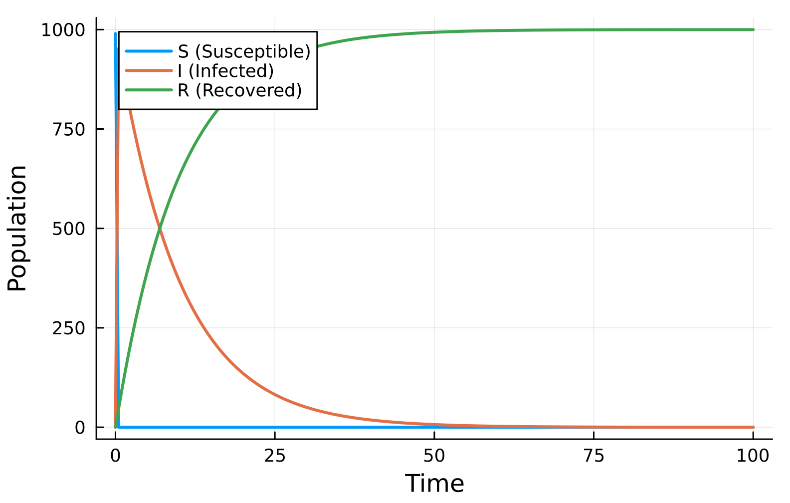
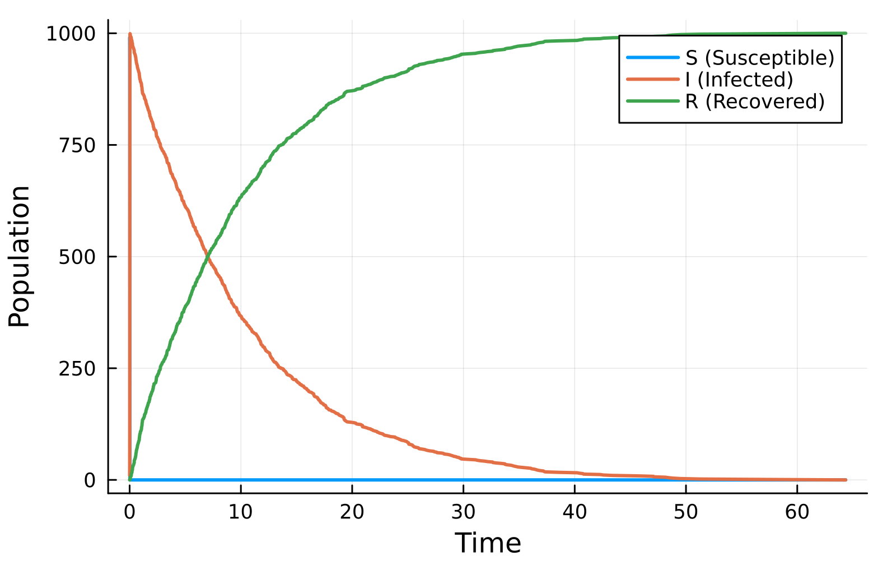
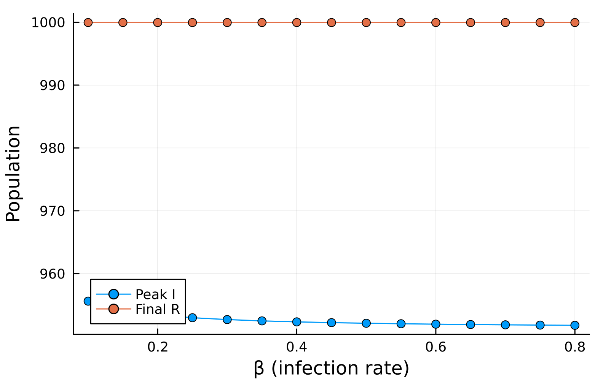
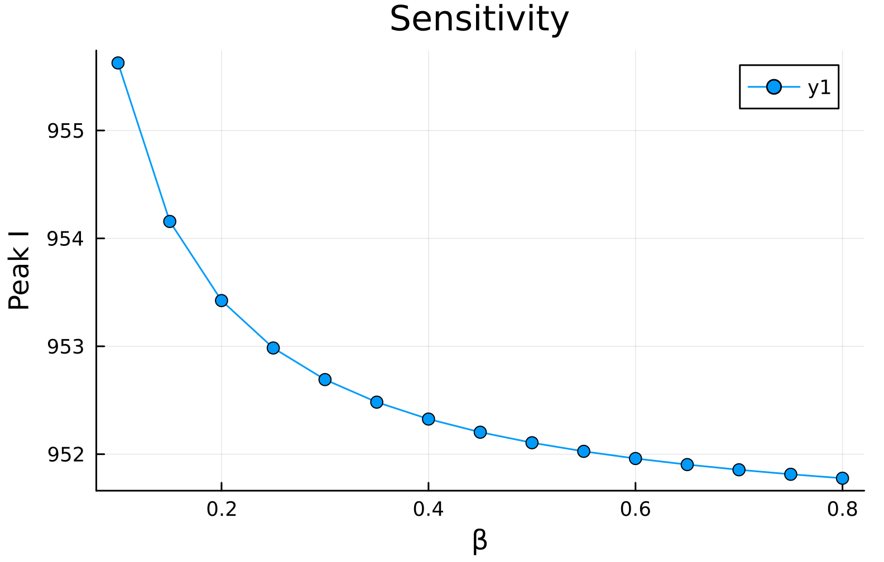

---
## Author
author:
  name: Арбатова Варвара Петровна
  email: 1132236020@rudn.ru
  affiliation:
    - name: Российский университет дружбы народов
      country: Российская Федерация
      postal-code: 117198
      city: Москва
      address: ул. Миклухо-Маклая, д. 6

## Title
title: "Отчёт по лабораторной работе №6"
subtitle: "Иммитационное моделирование"
license: "CC BY"
---

# Теоретическое введение

## 1. Сети Петри: формализм для моделирования дискретных систем

Сети Петри (Petri nets) — это математический аппарат для моделирования и анализа дискретных параллельных и асинхронных систем. Впервые они были предложены Карлом Адамом Петри в 1962 году. Основными элементами сети Петри являются:

- **Позиции (places)** — пассивные элементы, описывающие состояние системы (обозначаются кругами);
- **Переходы (transitions)** — активные элементы, описывающие события (обозначаются прямоугольниками);
- **Фишки (tokens)** — маркеры, находящиеся внутри позиций, количество которых определяет текущую маркировку сети;
- **Дуги (arcs)** — направленные соединения между позициями и переходами (не между однотипными вершинами).

Сеть Петри формально определяется как четвёрка:

$$N = (P, T, F, M_0),$$

где:
- $P$ — конечное множество позиций;
- $T$ — конечное множество переходов;
- $F \subseteq (P \times T) \cup (T \times P)$ — множество дуг;
- $M_0: P \to \mathbb{N}$ — начальная маркировка.

### 1.1. Правило срабатывания перехода

Переход считается **разрешённым** (enabled), если каждая из его входных позиций содержит количество фишек, не меньшее кратности входной дуги. Разрешённый переход может **сработать** (fire), что приводит к изменению маркировки сети:

1. Из каждой входной позиции удаляется количество фишек, равное кратности входной дуги;
2. В каждую выходную позицию добавляется количество фишек, равное кратности выходной дуги.

Срабатывание перехода является атомарной операцией и происходит мгновенно. Если разрешено несколько переходов, может сработать любой из них (недетерминизм). Этот механизм позволяет моделировать параллельные и конкурирующие процессы.

### 1.2. Свойства сетей Петри

При анализе моделей на основе сетей Петри исследуются следующие ключевые свойства:

- **Ограниченность (boundedness)** — количество фишек в любой позиции не превышает заданного предела. Сеть называется безопасной, если этот предел равен 1;
- **Живость (liveness)** — гарантия того, что для любого перехода существует достижимая маркировка, в которой он может сработать (отсутствие вечных блокировок);
- **Достижимость (reachability)** — возможность из начальной маркировки перейти в целевую маркировку за конечное число срабатываний переходов;
- **Сохраняемость (conservation)** — взвешенная сумма фишек по всем позициям остаётся постоянной (аналог законов сохранения в физике).

## 2. Эпидемиологическая модель SIR

Модель SIR (Susceptible–Infectious–Recovered) — классическая математическая модель эпидемиологии, описывающая распространение инфекционного заболевания в закрытой популяции. Впервые она была предложена Кермаком и Маккендриком в 1927 году.

### 2.1. Компартменты модели

Вся популяция делится на три группы:

- **$S$ (Susceptible)** — восприимчивые к заболеванию индивиды, которые могут заразиться при контакте с инфицированными;
- **$I$ (Infectious)** — инфицированные индивиды, способные передавать инфекцию восприимчивым;
- **$R$ (Recovered)** — выздоровевшие (или умершие) индивиды, получившие иммунитет и более не участвующие в распространении болезни.

### 2.2. Дифференциальные уравнения

Динамика модели SIR описывается системой обыкновенных дифференциальных уравнений:

$$
\begin{aligned}
\frac{dS}{dt} &= -\frac{\beta S I}{N}, \\[4pt]
\frac{dI}{dt} &= \frac{\beta S I}{N} - \gamma I, \\[4pt]
\frac{dR}{dt} &= \gamma I,
\end{aligned}
$$

где:
- $\beta$ — коэффициент передачи инфекции (скорость заражения);
- $\gamma$ — скорость выздоровления ($1/\gamma$ — средняя продолжительность болезни);
- $N = S + I + R$ — общая численность популяции (постоянна).

### 2.3. Базовое репродуктивное число

Ключевым параметром модели является базовое репродуктивное число:

$$R_0 = \frac{\beta}{\gamma}.$$

Оно определяет среднее число вторичных заражений, вызванных одним инфицированным индивидом в полностью восприимчивой популяции:
- Если $R_0 > 1$ — эпидемия будет распространяться;
- Если $R_0 < 1$ — вспышка затухнет.

## 3. Представление модели SIR в виде сети Петри

Эпидемиологический процесс естественным образом представляется с помощью сетей Петри. Каждому состоянию соответствует позиция, а каждому процессу — переход.

### 3.1. Позиции (состояния)

- Позиция $S$ (Susceptible) — фишки в этой позиции обозначают восприимчивых индивидов;
- Позиция $I$ (Infectious) — фишки обозначают инфицированных;
- Позиция $R$ (Recovered) — фишки обозначают выздоровевших.

### 3.2. Переходы (события)

- Переход **infection** реализует процесс заражения: $S + I \to I + I$;
- Переход **recovery** реализует процесс выздоровления: $I \to R$.

### 3.3. Скорости срабатывания переходов

В зависимости от типа моделирования используются разные механизмы:

- Для **детерминированного моделирования (ODU)** — применяется закон действующих масс: скорость заражения $\beta \cdot S \cdot I$, скорость выздоровления $\gamma \cdot I$;
- Для **стохастического моделирования (алгоритм Гиллеспи)** — переходы срабатывают с интенсивностями $\beta S I$ и $\gamma I$, а время до следующего события генерируется из экспоненциального распределения.

## 4. Методы моделирования

### 4.1. Детерминированное моделирование (ODU)

Детерминированный подход описывает эволюцию системы как непрерывный процесс. Количество фишек в каждой позиции аппроксимируется непрерывными переменными, а динамика задаётся системой обыкновенных дифференциальных уравнений. Такой подход эффективен для больших популяций, где случайные флуктуации пренебрежимо малы.

### 4.2. Стохастическое моделирование (алгоритм Гиллеспи)

Алгоритм Гиллеспи (или алгоритм стохастической симуляции) [@gillespie_stochastic] точно учитывает дискретность и случайность событий. В отличие от детерминированного подхода, каждый прогон даёт различную траекторию, что важно для анализа систем с малым количеством частиц или когда случайные эффекты играют существенную роль.

Основные шаги алгоритма Гиллеспи:

1. Для каждого перехода вычисляется его интенсивность $a_j$ (скорость срабатывания);
2. Вычисляется суммарная интенсивность $a_0 = \sum_j a_j$;
3. Генерируется время до следующего события: $\Delta t = -\ln(r_1) / a_0$, где $r_1 \sim U(0,1)$;
4. Выбирается переход, который сработает, с вероятностью $a_j / a_0$;
5. Обновляется маркировка в соответствии с выбранным переходом;
6. Обновляется модельное время $t \leftarrow t + \Delta t$.

Сети Петри [@murata_petri_nets] позволяют моделировать дискретные системы.
Алгоритм Гиллеспи [@gillespie_stochastic] используется для стохастического моделирования.
Классическая модель SIR была предложена Кермаком и Маккендриком [@kermack_mckendrick_1927].
Подробное описание лабораторной работы приведено в методических указаниях [@lab06_sir_petri].

# Цель лабораторной работы

Целью данной лабораторной работы является реализация и исследование эпидемиологической модели SIR с использованием аппарата сетей Петри. В рамках работы необходимо:

1. Построить сеть Петри для модели SIR (позиции $S$, $I$, $R$ и переходы infection, recovery);
2. Реализовать детерминированное моделирование (решение системы ОДУ);
3. Реализовать стохастическое моделирование (алгоритм Гиллеспи);
4. Провести вычислительные эксперименты при различных значениях параметров $\beta$ и $\gamma$;
5. Сравнить детерминированный и стохастический подходы;
6. Проанализировать полученные результаты и визуализировать динамику эпидемического процесса.

# Выполнение лабораторной работы

## Базовый прогон модели

— Выполняет один базовый эксперимент с фиксированными параметрами $\beta$ =
0.3, γ = 0.1.
— Запускает два типа симуляции:
— детерминированную (решение ОДУ) — даёт плавную усреднённую динами-
ку;
— стохастическую (алгоритм Гиллеспи) — учитывает случайные флуктуации.
— Сохраняет результаты в CSV‑файлы и строит графики S(t), I(t), R(t) для обоих
типов.

— Детерминированный график показывает классический пик эпидемии: рост $I$,
максимум, затем спад до нуля; $R$ растёт и выходит на плато, $S$ падает.
— Стохастический график может иметь шумы и, возможно, немного отличаться
по времени пика и амплитуде – это демонстрирует влияние случайности.
— Сравнение двух типов симуляции показывает, что при большом начальном
числе восприимчивых (990) стохастическая траектория близка к детермини-
рованной, но при малых числах различия были бы значительны.



Выходные данные:

— data/sir_det.csv — таблица с колонками: time, S, I, R для детерминиро-
ванной симуляции.
— data/sir_stoch.csv — аналогичная таблица для стохастической симуляции.
— plots/sir_det_dynamics.png — график S(t), I(t), R(t) из ОДУ ([рис. @fig-001])
— plots/sir_stoch_dynamics.png — график стохастической траектории ([рис. @fig-002])

{#fig-001 width=70%}

{#fig-002 width=70%}

## Коэффициент заражения $\beta$

— Исследуется чувствительность модели к изменению параметра $\beta$ (скорости
заражения).
— Для каждого значения $\beta$ из диапазона 0.1:0.05:0.8 запускается детермини-
рованная симуляция (γ = 0.1 фиксирован).
— Для каждого прогона вычисляются:
— максимальное число инфицированных (пик эпидемии) – peak_I;
— конечное число выздоровевших – final_R.
— Результаты сводятся в таблицу и строится график зависимости peak_I($\beta$) и
final_R($\beta$)

— При малых $\beta$ (например, 0.1) эпидемия не возникает (peak_I ≈ 0, final_R ≈ 0).
— С ростом $\beta$ пик заболеваемости сначала резко растёт, затем достигает насыще-
ния (почти всё население переболевает).
— Конечное R($\beta$) также растёт с $\beta$, но медленнее; при больших $\beta$ практически всё
население переходит в R.
— Такой график демонстрирует пороговое явление, характерное для модели SIR:
существует критическое значение $\beta$, выше которого возникает вспышка.



— data/sir_scan.csv – таблица с колонками: $\beta$, peak_I, final_R.
— plots/sir_scan.png – график с двумя линиями: пик I($\beta$) и конечное R($\beta$) ([рис. @fig-003])

{#fig-003 width=70%}

## Анимация детерминированной динамики

— Создаёт GIF-анимацию, показывающую, как со временем меняется количество
людей в каждой из трёх групп (𝑆, 𝐼, 𝑅).
— Анимация позволяет наглядно увидеть распространение эпидемии, пик и
спад.

— На первых кадрах 𝐼 растёт, 𝑆 падает.
— В момент пика 𝐼 достигает максимума, затем снижается, а 𝑅 растёт.
— Анимация даёт динамическое представление о том, как волна инфекции про-
ходит через популяцию.



— plots/sir_animation.gif — анимация, где каждый кадр соответствует одному
моменту времени и отображает столбчатую диаграмму $S$, $I$, $R$ 

## Итоговый отчёт

— Загружает ранее сохранённые результаты (sir_det.csv, sir_stoch.csv,
sir_scan.csv) и строит сравнительные графики для итогового отчёта:
— Сравнение детерминированной и стохастической динамики инфицирован-
ных I(t).
— Зависимость пика I от $\beta$ (результат сканирования).

— Сравнение детерминированной и стохастической кривых I(t) показывает, на-
сколько велик разброс, вызванный случайностью. При большом размере попу-
ляции они близки.
— График чувствительности позволяет количественно оценить, как изменение
заразности $\beta$ влияет на тяжесть эпидемии (пик I). Это важно для принятия
решений (например, меры по снижению $\beta$)



— plots/comparison.png — два графика I(t) (детерминированный vs стохасти-
ческий) на одной координатной плоскости {#fig-004 width=70%}
— plots/sensitivity.png — график peak_I($\beta$) (те же данные, что и в
sir_scan.png) {#fig-005 width=70%}

{#fig-004 width=70%}

{#fig-005 width=70%}

# Выводы

Я выполнила предложенный код и построила сеть Петри для модели SIR

# Список литературы{.unnumbered}

::: {#refs}
:::
