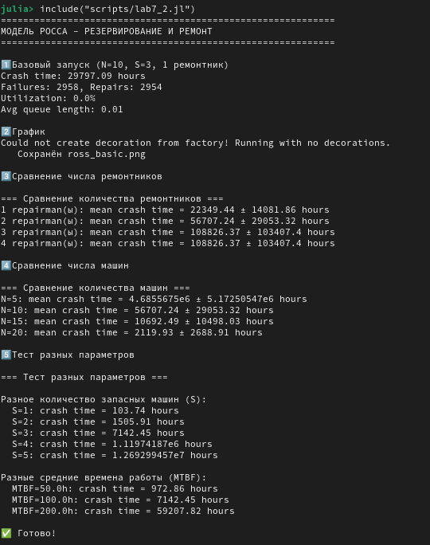
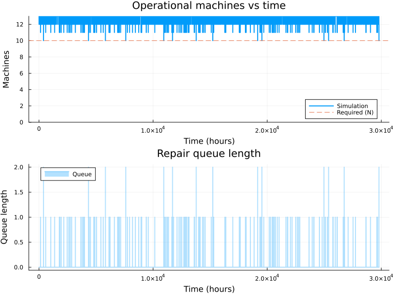

---
## Author
author:
  name: Арбатова варвара Петровна
  email: 1132236020@rudn.ru
  affiliation:
    - name: Российский университет дружбы народов
      country: Российская Федерация
      postal-code: 117198
      city: Москва
      address: ул. Миклухо-Маклая, д. 6
## Title
title: Презентация по лабораторной работе №7
subtitle: Иммитационное моделирование
license: CC BY
date: today
date-format: "YYYY-MM-DD" # Example: 2025-09-06
---

# Цель работы

Разобраться в Модели Росса

# Задание

— Переведите в структуру DrWatson.
— Добавьте нескольких ремонтников.
— Сделайте прогон для разного количества машин.
— Проведите мониторинг загрузки ремонтника, средней длины очереди на ремонт.
— Построение графиков изменения числа исправных машин во времени.
— Сравните с аналитическим решением.

# Теоретическое введение

## Модель Росса: Система с резервированием и ремонтом

Модель Росса (Ross model) представляет собой классическую задачу теории массового обслуживания, описывающую систему с конечной популяцией, резервированием и ремонтом. Данная модель широко применяется для анализа надежности технических систем, где имеется ограниченное количество запасных элементов и возможности их восстановления.

## Формальная постановка задачи

Система состоит из следующих элементов:

- **N идентичных работающих машин** - постоянно функционируют и могут выходить из строя
- **S машин в резерве** - находятся в исправном состоянии и готовы немедленно заменить любую отказавшую машину
- **M ремонтных устройств (ремонтников)** - осуществляют восстановление вышедших из строя машин

## Процесс функционирования

При отказе работающей машины происходит следующая последовательность событий:

1. **Мгновенная замена** - если имеется хотя бы одна резервная машина, она немедленно запускается в работу вместо отказавшей
2. **Отправка в ремонт** - отказавшая машина поступает в очередь на ремонт
3. **Восстановление** - когда ремонтное устройство освобождается, начинается ремонт машины
4. **Пополнение резерва** - после завершения ремонта машина становится исправной и переходит в резерв

## Критическое состояние

Система прекращает свое функционирование (происходит "падение" системы, crash) в момент, когда:

- Отказывает работающая машина
- Резерв полностью отсутствует ($S = 0$)
- Нет возможности немедленной замены

# Математическая модель

## Математическая модель

Модель базируется на следующих предположениях:

1. **Экспоненциальное распределение времени безотказной работы** - каждая работающая машина имеет интенсивность отказов $\lambda$, то есть время до отказа распределено как $Exp(\lambda)$
2. **Экспоненциальное распределение времени ремонта** - время восстановления одной машины одним ремонтником распределено как $Exp(\mu)$
3. **Независимость событий** - отказы машин и времена ремонта независимы между собой
4. **Мгновенная замена** - время замены отказавшей машины на резервную пренебрежимо мало

## Параметры модели

| Параметр | Обозначение | Смысл | Значение по умолчанию |
|----------|-------------|-------|----------------------|
| $N$ | Количество машин | Основные работающие машины | 10 |
| $S$ | Количество резервных машин | Исправные машины в резерве | 3 |
| $\lambda$ | Интенсивность отказов | $1/MTBF$, где MTBF - среднее время безотказной работы | $1/100$ ч$^{-1}$ |
| $\mu$ | Интенсивность ремонта | $1/MTTR$, где MTTR - среднее время ремонта | 1 ч$^{-1}$ |
| $M$ | Количество ремонтников | Параллельных ремонтных устройств | 1 |
| $T$ | Время до падения | Время исчерпания резерва | $E[T]$ - искомая величина |

# Аналитические характеристики

## Загрузка системы

Интенсивность отказов всей системы:
$$\lambda_{total} = N \cdot \lambda$$

Загрузка одного ремонтника:
$$\rho = \frac{N \lambda}{M \mu}$$

**Условие стационарности:** $\rho < 1$ (в противном случае очередь на ремонт растет неограниченно)

## Ожидаемое время до падения

Для системы с одним ремонтником ($M = 1$) приближенная формула:

$$E[T] \approx \frac{1}{N\lambda} \cdot \left(\frac{1}{\rho}\right)^S \cdot \frac{1}{S!(1-\rho)}$$

где $\rho = N\lambda/\mu$.

## Характеристики качества

**Среднее время до падения ($E[T]$)** - основная характеристика надежности системы

**Загрузка ремонтников**:
$$U = \frac{\text{суммарное время ремонта}}{M \cdot T}$$

**Средняя длина очереди на ремонт**:
$$L_q = \frac{1}{T} \int_0^T Q(t) dt$$

где $Q(t)$ - длина очереди в момент времени $t$

# Выполнение лабораторной работы

{#fig-001 width=70%}

##

{#fig-002 width=70%}

##

{#fig-003 width=70%}

# Выводы

Мы познакоились с моделью Росса

