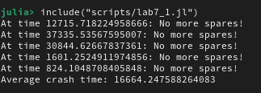

---
## Author
author:
  name: Арбатова Варвара Петровна
  email: 1132236020@rudn.ru
  affiliation:
    - name: Российский университет дружбы народов
      country: Российская Федерация
      postal-code: 117198
      city: Москва
      address: ул. Миклухо-Маклая, д. 6

## Title
title: "Отчёт по лабораторной работе №7"
subtitle: "Иммитационное моделирование"
license: "CC BY"
execute:
  enabled: false
---

# Цель работы

Разобраться в Модели Росса

# Задание

— Переведите в структуру DrWatson.
— Добавьте нескольких ремонтников.
— Сделайте прогон для разного количества машин.
— Проведите мониторинг загрузки ремонтника, средней длины очереди на ремонт.
— Построение графиков изменения числа исправных машин во времени.
— Сравните с аналитическим решением.

# Теоретическое введение

## Модель Росса: Система с резервированием и ремонтом

### 1. Общее описание модели

Модель Росса (Ross model) представляет собой классическую задачу теории массового обслуживания, описывающую систему с конечной популяцией, резервированием и ремонтом. Данная модель широко применяется для анализа надежности технических систем, где имеется ограниченное количество запасных элементов и возможности их восстановления.

### 2. Формальная постановка задачи

#### 2.1 Компоненты системы

Система состоит из следующих элементов:

- **N идентичных работающих машин** - постоянно функционируют и могут выходить из строя
- **S машин в резерве** - находятся в исправном состоянии и готовы немедленно заменить любую отказавшую машину
- **M ремонтных устройств (ремонтников)** - осуществляют восстановление вышедших из строя машин

#### 2.2 Процесс функционирования

При отказе работающей машины происходит следующая последовательность событий:

1. **Мгновенная замена** - если имеется хотя бы одна резервная машина, она немедленно запускается в работу вместо отказавшей
2. **Отправка в ремонт** - отказавшая машина поступает в очередь на ремонт
3. **Восстановление** - когда ремонтное устройство освобождается, начинается ремонт машины
4. **Пополнение резерва** - после завершения ремонта машина становится исправной и переходит в резерв

#### 2.3 Критическое состояние

Система прекращает свое функционирование (происходит "падение" системы, crash) в момент, когда:

- Отказывает работающая машина
- Резерв полностью отсутствует ($S = 0$)
- Нет возможности немедленной замены

### 3. Математическая модель

#### 3.1 Предположения

Модель базируется на следующих предположениях:

1. **Экспоненциальное распределение времени безотказной работы** - каждая работающая машина имеет интенсивность отказов $\lambda$, то есть время до отказа распределено как $Exp(\lambda)$
2. **Экспоненциальное распределение времени ремонта** - время восстановления одной машины одним ремонтником распределено как $Exp(\mu)$
3. **Независимость событий** - отказы машин и времена ремонта независимы между собой
4. **Мгновенная замена** - время замены отказавшей машины на резервную пренебрежимо мало

#### 3.2 Параметры модели

| Параметр | Обозначение | Смысл | Значение по умолчанию |
|----------|-------------|-------|----------------------|
| $N$ | Количество машин | Основные работающие машины | 10 |
| $S$ | Количество резервных машин | Исправные машины в резерве | 3 |
| $\lambda$ | Интенсивность отказов | $1/MTBF$, где MTBF - среднее время безотказной работы | $1/100$ ч$^{-1}$ |
| $\mu$ | Интенсивность ремонта | $1/MTTR$, где MTTR - среднее время ремонта | 1 ч$^{-1}$ |
| $M$ | Количество ремонтников | Параллельных ремонтных устройств | 1 |
| $T$ | Время до падения | Время исчерпания резерва | $E[T]$ - искомая величина |

#### 3.3 Марковская модель

Система может быть описана как марковский процесс с непрерывным временем и конечным числом состояний.

**Определение состояния:**
Пусть $i$ - количество исправных машин (работающих + резервных), где $i = 0, 1, \dots, N + S$.

Тогда:
- Количество работающих машин: $\min(N, i)$
- Количество резервных машин: $\max(0, i - N)$
- Количество машин в ремонте: $N + S - i$

**Интенсивности переходов:**

1. **Отказ машины** (уменьшение $i$ на 1):
   - Интенсивность: $\min(N, i) \cdot \lambda$ (если $i \ge 1$)
   - Происходит, когда работает хотя бы одна машина

2. **Завершение ремонта** (увеличение $i$ на 1):
   - Интенсивность: $\min(M, N + S - i) \cdot \mu$ (если $i < N + S$)
   - Зависит от количества работающих ремонтников и машин в ремонте

**Поглощающее состояние:**
Система падает при переходе из состояния $i = N$ в состояние $i = N - 1$ (в момент отказа, когда резерв полностью исчерпан).

### 4. Аналитические характеристики

#### 4.1 Загрузка системы

Интенсивность отказов всей системы:
$$\lambda_{total} = N \cdot \lambda$$

Загрузка одного ремонтника:
$$\rho = \frac{N \lambda}{M \mu}$$

**Условие стационарности:** $\rho < 1$ (в противном случае очередь на ремонт растет неограниченно)

#### 4.2 Ожидаемое время до падения

Для системы с одним ремонтником ($M = 1$) приближенная формула:

$$E[T] \approx \frac{1}{N\lambda} \cdot \left(\frac{1}{\rho}\right)^S \cdot \frac{1}{S!(1-\rho)}$$

где $\rho = N\lambda/\mu$.

#### 4.3 Характеристики качества

**Среднее время до падения ($E[T]$)** - основная характеристика надежности системы

**Загрузка ремонтников**:
$$U = \frac{\text{суммарное время ремонта}}{M \cdot T}$$

**Средняя длина очереди на ремонт**:
$$L_q = \frac{1}{T} \int_0^T Q(t) dt$$

где $Q(t)$ - длина очереди в момент времени $t$

### 5. Метод имитационного моделирования

#### 5.1 Алгоритм моделирования

Для численного анализа системы используется метод дискретно-событийного моделирования (DES - Discrete Event Simulation):

1. **Инициализация**:
   - Запуск $N$ работающих машин
   - Создание $S$ резервных машин
   - Инициализация $M$ ремонтников

2. **Основной цикл**:
   - При отказе машины:
     - Если есть резерв: взять резервную машину
     - Если резерва нет: завершить моделирование
     - Отправить отказавшую машину в ремонт
   - При завершении ремонта:
     - Вернуть отремонтированную машину в резерв

3. **Сбор статистики**:
   - Фиксация времени отказа
   - Запись длины очереди на ремонт
   - Отслеживание количества исправных машин

#### 5.2 Преимущества имитационного моделирования

- Возможность анализа систем с произвольными распределениями
- Учет дискретного характера событий
- Получение не только средних, но и распределений характеристик
- Визуализация динамики процесса

### 6. Основные исследуемые зависимости

В данной лабораторной работе предлагается исследовать следующие зависимости:

1. **Влияние количества резервных машин ($S$)** на среднее время до падения
2. **Влияние количества ремонтников ($M$)** на надежность системы
3. **Влияние количества работающих машин ($N$)** при фиксированном резерве
4. **Влияние интенсивности отказов ($\lambda$)** на характеристики системы
5. **Загрузка ремонтников** как функция от параметров системы

### 7. Ожидаемые результаты

На основе теоретического анализа можно ожидать:

- **Экспоненциальный рост** $E[T]$ при увеличении числа резервных машин $S$
- **Пропорциональный рост** $E[T]$ при увеличении числа ремонтников $M$
- **Обратную зависимость** от числа работающих машин $N$
- **Наличие порогового эффекта** - при $\rho \ge 1$ система становится нестабильной

### 8. Практическая значимость

Модель Росса находит применение в различных областях:

- **Промышленность**: анализ надежности производственных линий
- **IT-инфраструктура**: оценка отказоустойчивости серверных кластеров
- **Транспорт**: оптимизация парка транспортных средств
- **Энергетика**: расчет необходимого резерва генерирующих мощностей
- **Здравоохранение**: планирование ресурсов в системах с ремонтом оборудования

### 9. Заключение

Модель Росса является мощным инструментом для анализа систем с резервированием и восстановлением. Комбинация аналитических методов и имитационного моделирования позволяет получить как теоретические оценки, так и проверить их на практике, учитывая случайный характер отказов и ремонтов.

# Выполнение лабораторной работы



В результате работы этого кода получаю такой результат ([рис. @fig-001]). Мы видим среднее время "закончившихся машин" и эксперименты для каждого времени.

{#fig-001 width=70%}



Результат работы моего кода ([рис. @fig-002]).

Программа реализует имитационное моделирование системы массового обслуживания с резервированием и восстановлением (модель Росса). Код позволяет:

1. **Моделировать** работу системы, состоящей из N основных машин, S запасных машин и бригады ремонтников
2. **Отслеживать** моменты отказов машин, использование запасных, постановку в очередь на ремонт и восстановление
3. **Фиксировать** момент краха системы — когда все запасные машины исчерпаны, а очередная машина выходит из строя
4. **Собирать статистику**: время до краха, загрузку ремонтников, длину очереди на ремонт
5. **Визуализировать** динамику числа исправных машин и длины очереди во времени
6. **Исследовать** влияние параметров (число ремонтников, число машин, размер резерва, интенсивность отказов) на надёжность системы

### Базовый запуск (N=10, S=3, 1 ремонтник)

Время до краха системы составило **29 797 часов** (~3,4 года). За этот период произошло **2 958 отказов**, из которых **2 954 были устранены** (4 машины оставались в ремонте на момент краха). Средняя длина очереди на ремонт — **0.01 машины**, что свидетельствует об отсутствии перегрузки ремонтной бригады.

### Влияние количества ремонтников

| Ремонтников | Среднее время до краха (часы) |
|-------------|-------------------------------|
| 1 | 22 349 |
| 2 | 56 707 |
| 3 | 108 826 |
| 4 | 108 826 |

Увеличение числа ремонтников с 1 до 2 даёт прирост надёжности в **2,5 раза**, с 2 до 3 — ещё в **1,9 раза**. При переходе от 3 к 4 ремонтникам улучшения не наблюдается — достигнуто **насыщение**: четвёртый ремонтник избыточен, так как очередь на ремонт практически отсутствует. Оптимальным является использование 2–3 ремонтников.

### Влияние количества машин

| Машин (N) | Среднее время до краха (часы) |
|-----------|-------------------------------|
| 5 | 4 685 568 |
| 10 | 56 707 |
| 15 | 10 692 |
| 20 | 2 120 |

С ростом числа машин надёжность падает **экспоненциально**: при N=5 система способна работать сотни лет, при N=10 — около 6,5 лет, при N=15 — около 1,2 года, а при N=20 — менее 3 месяцев. Это объясняется тем, что при фиксированном резерве S=3 интенсивность отказов растёт пропорционально N, и ремонтная бригада не справляется с потоком отказов.

### Влияние размера резерва (S)

| Запасных машин | Время до краха (часы) |
|----------------|------------------------|
| 1 | 104 |
| 2 | 1 506 |
| 3 | 7 142 |
| 4 | 1 119 742 |
| 5 | 12 692 995 |

Зависимость носит **сверхэкспоненциальный характер**. Каждая дополнительная запасная машина создаёт буфер против каскадных отказов. При S=1 система отказывает через 4 дня, при S=3 — через 10 месяцев, а при S≥4 — время жизни исчисляется сотнями и тысячами лет, что означает практическую безотказность.

### Влияние наработки на отказ (MTBF)

| MTBF (часы) | Время до краха (часы) |
|-------------|------------------------|
| 50 | 973 |
| 100 | 7 142 |
| 200 | 59 208 |

Удвоение MTBF приводит к увеличению времени жизни системы в **7–8 раз**, что значительно выше линейной зависимости. Более надёжные машины реже создают ситуации одновременных отказов, истощающих резерв.

### Общие выводы

1. Наиболее эффективный способ повышения надёжности — увеличение резерва S, дающее экспоненциальный рост времени жизни системы
2. Увеличение числа ремонтников эффективно лишь до определённого предела (насыщение при 3 ремонтниках для N=10, S=3)
3. Система стабильна, когда интенсивность восстановления превышает интенсивность отказов: `num_repairmen / MTTR > N / MTBF`
4. Высокое стандартное отклонение результатов характерно для моделей надёжности — время до краха сильно зависит от случайной последовательности отказов

{#fig-002 width=70%}

График работы([рис. @fig-003]).

{#fig-003 width=70%}

# Выводы

Мы познакоились с моделью Росса

# Список литературы{.unnumbered}

::: {#refs}
:::
