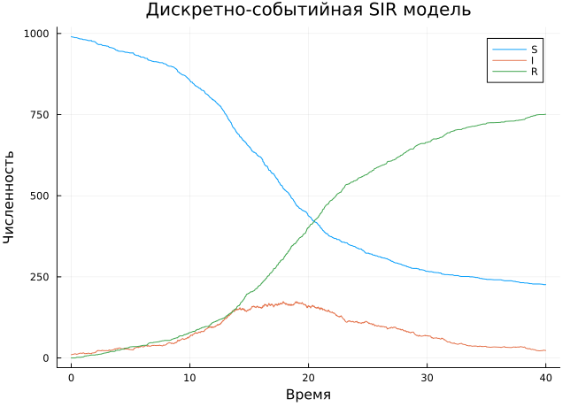
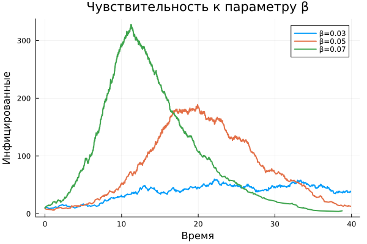
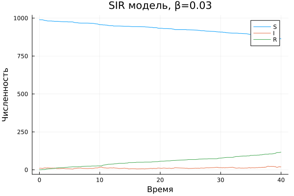
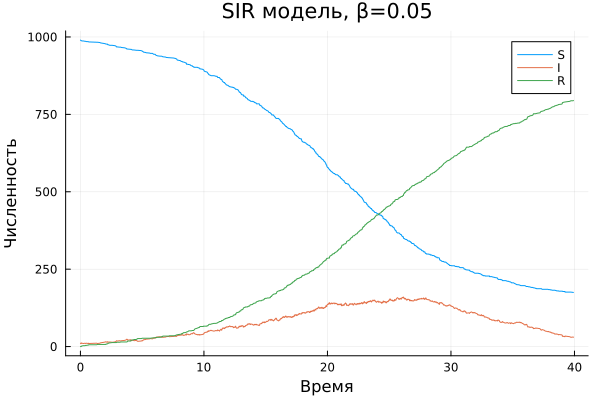
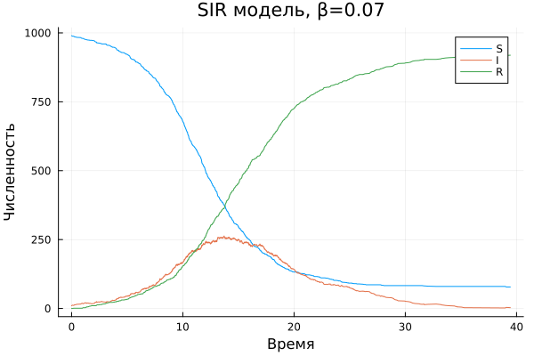
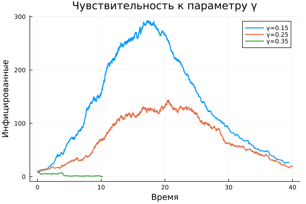
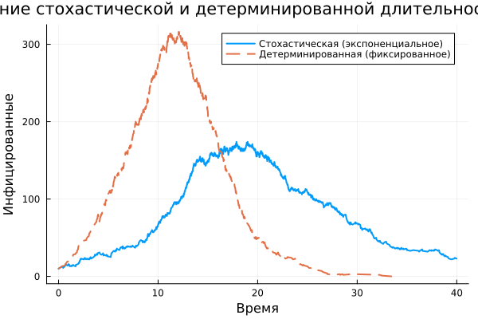
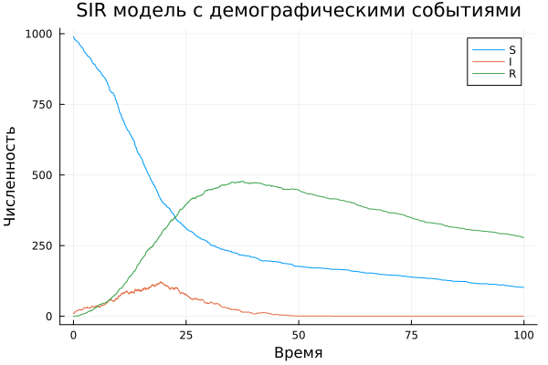
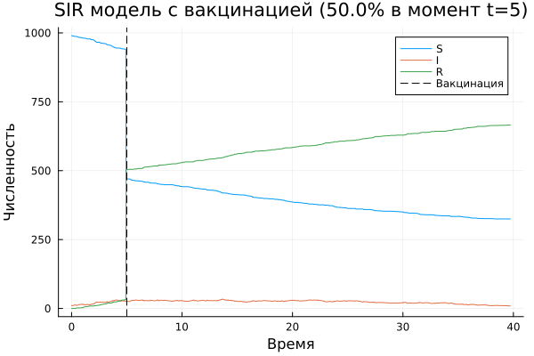

---
## Author
author:
  name: Арбатова Варвара Петровна
  email: 1132236020@rudn.ru
  affiliation:
    - name: Российский университет дружбы народов
      country: Российская Федерация
      postal-code: 117198
      city: Москва
      address: ул. Миклухо-Маклая, д. 6
## Title
title: Презентация по лабораторной работе №8
subtitle: Иммитационное моделирование
license: CC BY
date: today
date-format: "YYYY-MM-DD" # Example: 2025-09-06
---

#  Информация

## Докладчик

:::::::::::::: {.columns align=center}
::: {.column width="70%"}

  * Арбатова Варвара Петровна
  * студентка
  * Российский университет дружбы народов им. П. Лумумбы
  * [1132236020@rudn.ru]
  * <https://vparbatova.github.io/ru/>
  
:::
::::::::::::::

# Цель работы

- Реализовать стохастическую дискретно-событийную SIR-модель на Julia  
- Провести анализ чувствительности, сравнить стохастическую и детерминированную версии  
- Расширить модель: демография, вакцинация, SEIR

# Выполнение лабораторной работы

## Базовая SIR модель

{#fig-001 width=50%}

##

*Динамика S, I, R при β=0.05, c=10.0, γ=0.25*

- Пик инфекции ~ 20 ед. времени  
- Итоговая доля переболевших ~ 80%

## Анализ чувствительности к β

**Влияние вероятности заражения на динамику инфекции**

{#fig-002 width=50%}

##

- β = 0.03 — эпидемия почти не развивается  
- β = 0.05 — классическая волна  
- β = 0.07 — быстрый рост, высокий пик

## Индивидуальные траектории для разных β

β = 0.03

  
β = 0.05

  
β = 0.07

## Анализ чувствительности к γ

**Влияние скорости выздоровления**

{#fig-001 width=50%}

- γ = 0.15 — длительная инфекция, высокий пик  
- γ = 0.35 — быстрое выздоровление, эпидемия подавлена

## Стохастическая vs детерминированная длительность болезни

{#fig-001 width=50%}

## 

- Стохастическая версия (экспоненциальное время) — разброс, «хвосты»  
- Детерминированная (фиксированное время) — более синхронные волны  

## Демографические события (рождение + смерть)

{#fig-001 width=50%}

- μ = 0.01, ν = 0.02  
- Популяция не постоянна  
- Формирование эндемического равновесия

## Вакцинация (50% в момент t = 5)

{#fig-001 width=50%}

- Резкое снижение числа восприимчивых  
- Значительное уменьшение пика инфекции  
- Вакцинация эффективно подавляет эпидемию

# Выводы

✅ Реализована дискретно-событийная SIR модель на Julia  
✅ Проведён анализ чувствительности к β, c, γ  
✅ Показана разница между стохастическим и детерминированным подходами  
✅ Добавлены демографические процессы, вакцинация  
✅ Модель расширена до SEIR (график не показан, но выполнен)

# Спасибо за внимание!
